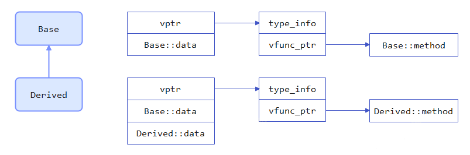

# C++与Python的OOP比较

C++和Python都是从C语言演变出来的面向对象（OOP）的编程语言，本文基于OOP三特性，比较C++和Python的异同点。

## 1. OOP三特性

**封装**：将相关数据和操作数据的方法打包成一个类。不同的类相互隔离，也可以自由组合。
**继承**：从一个父类衍生出子类，子类可以自然地拥有与父类的相同的属性和行为。
**多态**：子类与父类或者兄弟类在某一种行为上有所区别，即同一函数不同实现。
个人理解，继承保持了类之间的共性，多态使得这些具有共性的类之间有各自的特性。

## 2. 封装

类是一组数据以及操这组数据的函数（方法）的集合。类是对象的抽象模板，对象是类的具体实例，给类的数据取不同的值，同一个类就产成了不同的对象。

### 数据

于是数据应该有两种：一种是与**类级别**的，同一个类取值都一样，与实例无关；另一种是**实例级别**的，同一个类的不同实例取值各不相同。

| 数据类别 | C++     | Python |
|:----:|:-------:|:------:|
| 类级别  | 静态数据成员  | 类变量    |
| 实例级别 | 非静态数据成员 | 实例变量   |

### 方法

既然数据有两种，方法至少也应该有两种，一种是类级别的，一种是实例级别的。类级别的数据在实例化之前就存在，在实例化之前操作类级别的数据，是一种方法。实例化之后产生了实例级别的数据，这时候的方法可以同时操作两类数据，是另一种方法。

| 可操作数据    | C++     | Python |
|:--------:|:-------:|:------:|
| 类级别      | 静态成员函数  | 类方法    |
| 类级别和实例级别 | 非静态成员函数 | 实例方法   |

C++中还有一种重要方法是**虚函数**，使用虚函数可以实现C++中的多态。
Python中还有一种方法是静态方法。在Python中可以认为，实例方法传入了实例对象的指针，类方法传入了类的指针，而静态方法既不需要传入实例，也不需要传入类。

## 3. 继承

子类继承父类，使子类拥有父类的数据和方法。

### 单一继承

这种情况下，python和C++的最大区别应该在于继承方式。C++继承分为public、private、protected三种，Python都是public。

### 多重继承

没有虚函数的情况下，区别主要有两点：
(1) 假设函数名为fun，当多个父类中定义方法fun，而子类没有定义方法fun，通过子类调用方法fun，C++会**报错**，Python会使用**MRO**来确定调用哪个父类的fun。
(2) 对菱形继承的情况，C++要使用**虚继承**，Python要使用**super结合MRO**。

## 4. 多态

多态在代码上的表现为一个方法多个实现。C++的多态必须建立在继承基础上，现有继承，后有多态。Python的多态没有继承关系的限制，只要实现了同名方法即可。

### C++多态

前文介绍了[C++内存模型](./C++对象模型：对象内存布局.md)，这里只说最简单的单一继承情况。C++通过父类的指针或引用调用虚函数，在编译期间无法确定调用的是父类的实现还是子类的实现，只有在执行期间访问内存模型中的虚函数表才能确定。
假设Derived类继承Base类，Base类中定义了虚函数method，Derived类重写了虚函数method，此时Base类和Derived类的对象模型如图：


执行如下代码：

```C++
Base *ptr = new Derived();
ptr->method();
```

编译器看到ptr是Base类型，如果method不是虚函数，那么执行的应该是Base::method。现在method是虚函数，执行期调用Base::method还是Derived::method，要看赋给ptr的是Base对象地址还是Derived对象地址。上面的代码是创建了一个Derived对象，并把地址传给Base类指针，但是内存模型中的vptr指向的仍然是Derived类实现的虚函数，所以最后调用的是Derived::method。

### Python多态

相比C++复杂的内存模型，Python的鸭子类型让多态更灵活（Python内存模型跟多态的关系好像不大）。

```Python
class Cat:
    @classmethod
    def say(cls):
        print("miao miao")

class Dog:
    @classmethod
    def say(cls):
        print("wang wang")

def func(kls):
    kls.say()
```

这里Cat和Dog没有继承关系，say也不是虚函数，调用func(Cat)和func(Dog)都能正确执行。要是再定义个Person类，只要定义了方法say，就可以把Person传给func完成调用。

## 5. 写在最后

虽然都是从C语言发展出来的OOP语言，C++和Python的区别还是挺大的，特别是多态的处理，所以对相同逻辑的多态执行结果也是有区别的：

**C++示例**

```C++
#include <iostream>

class Base
{
public:
    int x = 1;
    virtual void print() { std::cout << x << std::endl; }
};

class Derived : public Base
{
public:
    int x = 2;
};

int main() {
    Base *ptr = nullptr;
    ptr = new Base();
    ptr->print();  // 打印1
    ptr = new Derived();
    ptr->print();  // 打印1
}
```

**Python示例**

```Python
class Base:
    def __init__(self):
        self.x = 1
    def print(self):
        print(self.x)

class Derived(Base):
    def __init__(self):
        self.x = 2

def func(Kls):
    obj = Kls()
    obj.print()

func(Base)     // 打印1
func(Derived)  // 打印2
```


