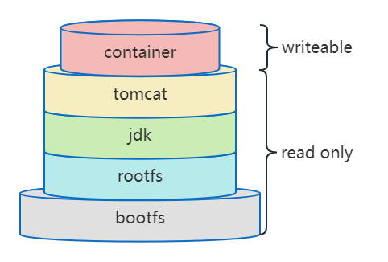
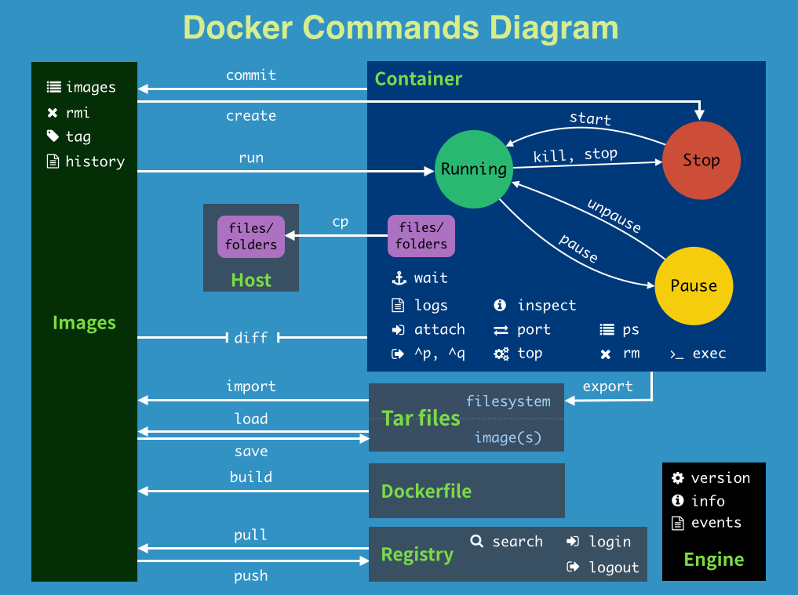

# Docker必知必会

## 一、基本概念

Docker是一种轻量级的虚拟化技术，可以让开发者非常便捷地实现应用程序的打包、移植、启动等操作，在软件开发、交付和部署中，有非常广泛的应用。

Docker容器与传统虚拟机的架构对比如下：


传统VM使用Hypervisor通过对物理主机的硬件资源进行协调和管理，为每个GuestOS分配独立的资源，让每个GuestOS成为一个虚拟主机，不同的GuestOS中的应用程序互不影响。Docker容器直接运行在物理主机的HostOS上，共用物理主机的硬件资源，Container Engine负责实现容器之间的资源隔离，让每个容器的应用独立地运行。

可以看出，容器比虚拟机少了一层GuestOS，容器占用资源更少，启动更快，但隔离程度不如虚拟机。容器和虚拟机简要对比如下：

| 维度   | 容器   | 虚拟机   |
| ---- | ---- | ----- |
| 隔离级别 | 进程级  | 操作系统级 |
| 镜像大小 | K-M级 | M-G级  |
| 启动时间 | 秒级   | 分钟级   |
| 性能表现 | 接近原生 | 有损耗   |
| 移植性  | 轻量   | 重量    |
| 隔离性  | 弱    | 强     |
| 安全性  | 弱    | 强     |

Docker中有三个常见的名词：镜像、容器和仓库。这里先简单介绍下概念，知道是什么就行，后面再详细说明。

### （一）镜像（Image）

镜像是一个特殊的文件系统，提供容器运行时所需的环境和配置，例如程序、库、资源、配置等文件，以及环境变量、匿名卷、用户等配置参数。镜像是静态的，不包含任何动态数据，在镜像构建之后，其内容不会发生改变。

### （二）容器（Container）

容器和镜像的关系，类似于面向对象编程中对象和类的关系，容器是运行镜像后得到的实例，运行镜像就相当于类的实例化，多次运行镜像，可以得到多个容器。容器是动态的，可以对容器进行创建、删除、启动、停止、暂停等操作。

容器实质上是运行在宿主机上的进程，Docker是用特殊的技术将容器与宿主机上的其他进程隔离开来，使得容器内的应用看起来是运行在一个独立的环境中。

### （三）仓库（Repository）

仓库类似github，对镜像进行存储和分发。在任一宿主机上，都可以从仓库拉取指定镜像，也可以把自己打包好的镜像上传到仓库，供他人访问。默认的是官方仓库Docker Hub，拥有众多官方镜像，国内访问需要配加速器，如阿里云的镜像仓。也可以自行搭建本地私有镜像仓。

## 二、基础原理

前面提到，容器是宿主机用特殊机制隔离出来的进程。为了实现容器进程的互不干扰，这个机制需要解决两个基本问题：

1. 容器内屏蔽容器外的情况，使用Linux的Namespace机制
2. 容器拥有独立的资源，使用Linux的Cgroups机制

### （一）Namespace

顾名思义，Namespace就是命名空间。C++使用命名空间解决了类型、变量和函数的冲突问题。Docker容器也具有自己的命名空间，通过命名空间对资源对象进行隔离，使得不同的容器进程号、用户、文件目录等相互屏蔽。Linux支持的命名空间有以下几种：

| Namespace | Flag          | Isolates  |
| --------- | ------------- | --------- |
| Mount     | CLONE_NEWNS   | 隔离文件系统挂载点 |
| IPC       | CLONE_NEWIPC  | 隔离进程间通信   |
| Network   | CLONE_NEWNET  | 隔离网络      |
| PID       | CLONE_NEWPID  | 隔离进程ID    |
| USER      | CLONE_NEWUSER | 隔离用户和用户组  |
| UTS       | CLONE_NEWUTS  | 隔离主机名和域名  |
| Time      | CLONE_NEWTIME | 隔离系统时间    |

### （二）Cgroups

Linux Cgroups的全称是Linux Control Group，主要用于对共享资源进行隔离、限制、审计。通过Cgroups限制容器能够使用的资源上限，包括CPU、内存、磁盘、网络带宽等，可以避免多个容器之间的资源竞争。Linux一切皆文件，Cgroups也是通过树状的文件系统来对资源进行限制。

- 查看cgroup挂载的目录，可以看到cgroup挂在sys/fs/cgroup节点，该路径下还有很多子目录（又称子系统），如cpu、memory等，每个子系统对应一种可以被限制的资源类型。
  

- 以cpu为例，查看cpu子系统。其中有两个参数cfs_period_us和cfs_quota_us通常组合使用，用于限制进程在长度为cfs_period_us的时间内，只能被分配到总量为cfs_quota_us的CPU时间。还有一个tasks文件，其中存放的是受限制的进程编号。
  
    

- cpu子系统中有个docker子目录，docker目录中的文件与cpu目录中的文件一样。当我们拉起一个容器，比如运行redis镜像，可以看到docker目录中又多了一层以容器id为名称的子目录。
  
    

综上两点，容器其实是一个启用了多种Namespace的进程，它能够使用的资源量收到Cgroups的限制。截至目前，我们使用Namespace和Cgroups为容器开辟了一个独立的运行环境，接下来我们再剖析一下容器里运行的镜像。

前面提到，容器镜像是一个文件系统，我们运行ubuntu的镜像，可以通过命令行查看根目录内容，也可以创建并执行脚本文件：


我们还可以把改动之后的文件系统打包成我们自己的镜像，下次直接执行：


可以看到，我们以ubuntu文件系统为基础，加了一层我们自己的修改，打包了一个新的镜像。容器镜像实际上就是以Linux的联合文件系统机制（UnionFS）实现分层文件系统。

### （三）UnionFS

UnionFS（联合文件系统），可以将不同目录挂载到同一个虚拟文件系统下。Docker利用UnionFS的功能，在基础文件系统上以增量的方式，叠加一层又一层新的文件系统，通过联合挂载，最终得到一个完整的Docker镜像文件系统。

Docker分层镜像的示例图如下，除了最顶层（称为容器层）是可写的，其他层（称为镜像层）都是只读的。UnoinFS将所有层都叠加起来，形成最后我们在容器中所看到的文件系统。



由于镜像层都是只读的，所有对文件的修改操作都发生在容器层中，Docker采用了 **Copy-On-Write（写时复制）** 的机制，具体来说：

- 新增文件：在容器层中创建文件
- 读取文件：自上而下在各层中查找文件，一旦找到，打开并读入内存
- 修改文件：自上而下在各层中查找文件，找到后，将文件复制到容器层，在容器层中修改对应文件
- 删除文件：自上而下在各层中查找文件，找到后，在容器层中记录删除操作

通过这种分层且只读的设计，使得每一个镜像层都是唯一且不变的，同一个镜像层可以在不同docker镜像中共享，只需要下载一次，存储一份，从而节省了大量的资源消耗和占用。

### （四）Volumes

由前所述，启动容器后，在容器内执行的所有文件的修改，都保存在容器层中，在删除容器时，对应的修改也会被删除。当我们需要保存修改的结果时，就需要用到数据卷（Data Volume），换句话说，数据卷提供了一种数据持久化的方式，使得在容器中产生的修改能永久的保留到宿主机上。数据卷的使用也很简单，在启动容器时，将宿主机的目录映射到容器中即可。

## 三、使用方法

### （一）命令行

与Linux一样，Docker主要通过命令行操作，Docker提供了非常多的命令，可以通过如下命令查看说明文档：

```shell
docker command --help
```

Docker命令主要涉及到镜像、容器、仓库的操作和使用，下图可以概览全貌：



以下列举一些常用的docker命令，各命令详细用法可以通过help查看：

#### 1. 镜像相关

- 搜索镜像：search
  
  ```shell
  docker search python
  ```

- 拉取镜像：pull，不指定标签时，默认拉取lastest版本
  
  ```shell
  docker pull python
  ```

- 推送镜像：push
  
  ```shell
  docker push python
  ```

- 构建镜像：build，根据Dockerfile构建镜像，Dockerfile见下一节内容。以下这条命令是指在根据当前目录的Dockerfile文件，构建一个名为my_python的镜像
  
  ```shell
   docker build -t my_python .
  ```

- 列出镜像：images，等同于image ls
  
  ```shell
  docker images
  ```

- 删除镜像：rmi，等同于image rm
  
  ```shell
  docker rmi python
  ```

#### 2. 容器相关

- 运行容器：run，创建一个容器，运行镜像文件
  
  ```shell
  docker run ubuntu
  ```

- 查看容器：ps，默认只列出运行中的容器，加-a参数可以列出所有容器，显示结果中第一列为CONTAINER ID，是容器的唯一标识
  
  ```shell
  docker ps -a
  ```

- 启动容器：start
  
  ```shell
  docker start 369dde08ff20
  ```

- 停止容器：stop
  
  ```shell
  docker stop 369dde08ff20
  ```

- 删除容器：rm
  
  ```shell
  docker rm 369dde08ff20
  ```

- 重启容器：restart
  
  ```shell
  docker restart 369dde08ff20
  ```

- 链接容器：attach，连接一个正在运行的容器
  
  ```shell
  docker attach 369dde08ff20
  ```

- 执行命令：exec，在正在运行的容器中执行命令。以下这条命令在ID为369dde08ff20的容器中，开启一个交互式命令行终端
  
  ```shell
  docker exec -it 369dde08ff20 /bin/bash
  ```

- 查看信息：inspect，查看镜像或容器的具体配置信息
  
  ```shell
  docker inspect 369dde08ff20
  ```

- 提交镜像：commit，将当前容器的修改保存为镜像
  
  ```shell
  docker commit -m "container to image" 369dde08ff20 my_ubuntu
  ```

- 查看变更：diff，将容器创建以来，文件系统中发生变更的文件和目录
  
  ```shell
  docker diff 369dde08ff20
  ```

- 拷贝文件：cp，用于在容器和宿主机之间拷贝数据。以下这条命令将容器中的/tmp目录，拷贝到宿主机中的/tmp目录
  
  ```shell
  docker cp 369dde08ff20:/tmp/ /tmp/
  ```

### （二）镜像制作

制作Docker镜像有两种方法，一种是在容器中使用commit提交修改，另一种是使用Dockfile进行build，后一种是主流做法。

Dockerfile是由一行行指令组成的脚本文件，每一行命令都会生成一个镜像层，多行命令生成多个镜像层，叠加生成最终的镜像文件。Dockerfile的常见指令及含义如图所示：


最后看个Dockerfile的小例子：

1. 编写Dockerfile文件
   
   
   
2. 生成镜像文件
   
   
   
3. 查看并运行镜像文件
   
   

## 四、参考资料

- [Docker原理（图解+秒懂+史上最全）](https://blog.csdn.net/crazymakercircle/article/details/120747767) 
- [Docker命令行官方手册](https://docs.docker.com/engine/reference/commandline/cli/) 
- [Dockerfile文件详解](https://www.cnblogs.com/panwenbin-logs/p/8007348.html)
