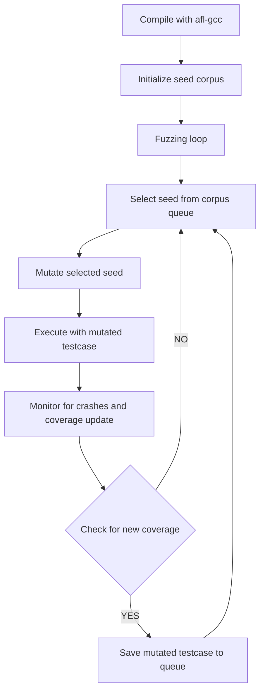
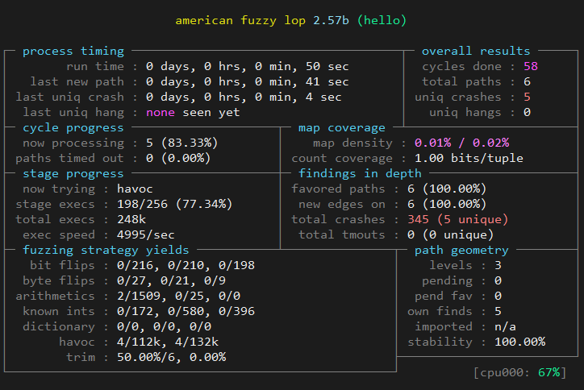

模糊测试工具 AFL的原理与实践
==================

在软件开发的世界里，质量和安全性是评估产品成败的重要指标。模糊测试作为一种高效的自动化测试方法，专门用来发现程序中的错误和安全漏洞。本文旨在详细介绍 AFL（American Fuzzy Lop）的基本原理和使用方法。

## 一、AFL 的原理介绍

模糊测试是一种通过向软件输入异常或随机数据的自动化技术，目的是发现程序在处理意外或边缘情况输入时的错误。AFL 是这一测试策略中的杰出代表，它通过不断学习程序反应来改进测试用例，提高测试的覆盖率和发现漏洞的概率。

AFL利用遗传算法，不断生成测试用例，并通过动态插桩技术监控程序的行为，特别是程序的代码覆盖情况。当新的输入能触发新的代码路径时，这个输入会被保存以供进一步的测试。该过程可以形成一个反馈循环，不断优化测试用例以探索更多程序状态。

下面是 AFL 工作流程图，展示了从准备测试用例到监控程序行为的步骤：



流程图详细展示了 AFL 在模糊测试中的核心步骤：

1. **编译（Compile with afl-gcc）** - 使用 AFL 提供的编译器 afl-gcc，对目标程序进行编译，实现程序的动态插桩。

2. **初始化种子库（Initialize seed corpus）** - 创建初始测试用例集（种子库），这些测试用例将作为模糊测试的起点。

3. **模糊测试循环（Fuzzing loop）** - 一个不断循环的过程，根据测试结果更新种子库，并反复执行下列子步骤：
   a. **选择种子（Select seed from corpus queue）** - 从种子库中选择一个种子文件作为当前测试的输入。
   b. **突变种子（Mutate selected seed）** - 对选中的种子文件应用突变算法，生成新的测试用例。
   c. **执行测试（Execute with mutated test case）** - 将变异后的测试用例作为输入执行已插桩的目标程序。
   d. **监控结果（Monitor for crashes and coverage update）** - 监控程序的执行情况，记录崩溃和代码覆盖率的变化。

4. **覆盖率检查（Check for new coverage）** - 判断是否出现新的代码覆盖，如果有，则将其保存为新测试用例。

5. **保存新测试用例（Save new testcase to queue）** - 将触发新代码覆盖的测试用例保存到队列中，用于后续的测试。

AFL采用了fork的运行模式，这使得当待测程序出现崩溃时，fuzz进程不会终止，这一点相较于LibFuzzer更具优势。然而，频繁的fork操作也导致了AFL的效率不如LibFuzzer。


## 二、AFL安装和运行

### 1. 支持的系统和架构

AFL设计之初主要针对UNIX-like系统，其在Linux系统上有最好的支持。然而，在社区的努力下，也有Windows版本的AFL，如winafl，其可以在Windows进行模糊测试。

AFL还支持多种CPU架构，其中对x86和x64架构的支持最好。如果要支持ARM架构，则需要使用AFL的QEMU模式。

### 2. 安装步骤

AFL可以通过源码进行安装：

```shell
apt install git make gcc
git clone https://github.com/google/AFL.git 
cd AFL && make
```

### 3. 运行参数

在安装并编译完 AFL 之后，可以使用 `afl-fuzz` 命令来启动模糊测试。一个基本的 AFL fuzz 命令如下：

```shell
afl-fuzz -i input_dir -o output_dir -- /path/to/program [options] @@
```

这里：

* `afl-fuzz` 是启动 AFL 模糊测试的程序。
* `-i input_dir` 指定包含初始化测试用例的目录。
* `-o output_dir` 指定存放的 fuzzing 结果的目录。

`--` 之后的部分是运行被测试程序的命令行，其中 `/path/to/program` 替换为需要进行模糊测试的程序的路径，`[options]` 是运行该程序的任何选项或参数。

如果测试程序需要从文件中读取输入，可以在实际输入文件路径的位置使用 `@@` 占位符。AFL 将替换 `@@` 来插入它正在测试的输入文件。如果省略这个占位符，AFL 将会把模糊测试用例通过 stdin 传递给测试程序。


### 三、AFL的使用示例

本节使用一个简单的示例，演示AFL的操作步骤。

这是待测源码，其功能是接受一行命令行输入，进行四则运算。其中使用了不安全的gets函数，可能导致缓冲区溢出：

```c
#include <stdio.h>
#include <string.h>

int calculate(int a, int b, char op) {
    switch (op) {
        case '+': return a + b;
        case '-': return a - b;
        case 'x': return a * b;
        case '/': return b ? a / b : 0;
        default: return 0;
    }
}

int main() {
    char input[100];

    // unsafe method that may cause buffer overflow
    gets(input);

    int a, b, result;
    char op;

    if (sscanf(input, "%d %c %d", &a, &op, &b) != 3)
        return 1;

    result = calculate(a, b, op);
    printf("Result: %d\n", result);

    return 0;
}


```

#### 1. 编译源码

使用AFL的编译器`afl-gcc`或`afl-clang`对源文件`hello.c`进行编译，添加所需要的代码覆盖插桩。`afl-gcc`或`afl-clang`实际上是对常规的`gcc`或`clang`编译器进行了封装，通过在编译时进行插桩，来统计fuzz过程中的代码覆盖率：

```shell
afl-gcc -o hello hello.c
```

#### 2. 准备种子语料库

不论程序是从file还是从stdin获取数据，AFL都需要一个初始语料库来启动模糊测试过程。输入（无论是来自file或stdin）是AFL用来开始探索程序行为的基础。初始语料库（seed corpus）是一组文件，其中包含了各种有效的输入示例，这些输入会被AFL用作模糊测试的起始点。

从stdin读取输入时，AFL会将语料库中的每个文件内容作为输入在每次测试运行时送到程序的标准输入流中。使用AFL时，必须要有初始语料库。注意这一点AFL与Libfuzzer不同，Libfuzzer只接受stdin，不接受file，初始语料库为可选项。

```shell
mkdir in
echo 'abc' > in/seed
```

#### 3. 执行测试

在运行AFL之前，需要执行下面的系统设置命令，将字符串"core"写入到文件`/proc/sys/kernel/core_pattern`中。

在Linux系统中，`/proc/sys/kernel/core_pattern` 文件用于指定当程序崩溃时，内核转储文件（core dump）的文件名模式。通过修改这个文件，可以控制内核生成core文件的行为。

通过执行这个命令，生成的核心转储文件将以"core"命名，这使得AFL更容易检测和处理目标程序的崩溃情况，从而更好地进行模糊测试。

```shell
echo core | tee /proc/sys/kernel/core_pattern
```

在hello中使用gets函数从stdin中读取数据，因此在运行AFL时，不需要添加`@@`。是否使用`@@`取决于待测程序接受的输入来自file还是stdin。

```shell
afl-fuzz -i in -o out -- ./hello
```

#### 4. 结果解读

AFL开始运行后，将会看到如下的界面显示：



从这个界面上可以看到AFL找到了多少crash，但还不能直观地显示覆盖率。[pythia](https://github.com/mboehme/pythia)是一款AFL的扩展工具，可以查看代码覆盖率的情况。

AFL在运行过程中，会不断地产生输出。输出目录结构如下：

```shell
out
|-- crashes
|   |-- README.txt
|   |-- id:000000,sig:06,src:000000,op:havoc,rep:64
|   |-- id:000001,sig:06,src:000002+000003,op:splice,rep:128
|   |-- id:000002,sig:06,src:000003,op:havoc,rep:32
|   |-- id:000003,sig:06,src:000002+000003,op:splice,rep:16
|   |-- id:000004,sig:06,src:000004,op:havoc,rep:32
|   |-- id:000005,sig:11,src:000003+000002,op:splice,rep:64
|   `-- id:000006,sig:06,src:000004+000005,op:splice,rep:2
|-- fuzz_bitmap
|-- fuzzer_stats
|-- hangs
|-- plot_data
`-- queue
    |-- id:000000,orig:seed
    |-- id:000001,src:000000,op:havoc,rep:16,+cov
    |-- id:000002,src:000000+000001,op:splice,rep:4,+cov
    |-- id:000003,src:000001,op:arith8,pos:1,val:-5,+cov
    |-- id:000004,src:000001,op:arith8,pos:1,val:-9,+cov
    `-- id:000005,src:000002+000003,op:splice,rep:4,+cov

3 directories, 17 files

```

- **queue/** - 存放AFL生成的触发新代码路径的测试样本

- **crashes/** - 存放能触发待测程序崩溃的测试样本

- **hangs/** - 存发导致待测程序超时的测试样本

- **fuzzer_stats** - 文本文件，包含了fuzzer的实时统计信息，如执行速度、路径覆盖等度量指标。这个文件不断更新以反映当前的fuzzing状态。

- **plot_data** - 文本文件，包含了AFL执行过程中的统计数据。使用AFL的`afl-plot`工具处理`plot_data`文件，可以生成fuzz过程的可视化图像。

- **fuzz_bitmap** - 这是用来记录路径覆盖率的位图（coverage bitmap），非人类可读。AFL使用这个位图来跟踪程序在处理不同输入时执行的不同分支，用来帮助AFL识别新的、唯一的代码路径，以便后续生成更具有探索性的测试样本。
  
  

### 四、AFL的QEMU模式

前面的例子中，AFL在对待测程序的源码进行编译时插桩。实际中，我们不一定能拿到待测源码，我们要测的可能是一个已经编译好的二进制文件。这种情况下Libfuzzer就无能为力了，但AFL还能用，这依赖于AFL的QEMU模式。

AFL的QEMU模式，也称为AFL-QEMU，允许你在二进制模糊测试中使用AFL，即使源代码不可用。这在对闭源应用进行模糊测试时非常有用。这种模式使用QEMU的用户模式仿真，来运行并分析非原生的二进制文件。以下是安装AFL的QEMU模式和使用步骤的指南：

#### 1. 编译QEMU支持

在AFL主目录下有一个专门的QEMU模式目录。进入该目录并编译QEMU模式，过程中可能缺少依赖项，根据提示进行安装即可：

```shell
cd qemu_mode
./build_qemu_support.sh
```

#### 2. AFL-QEMU使用步骤

用法很简单，在AFL运行命令中添加`-Q`参数即可：

```shell
afl-fuzz -i input -o output -Q -- /path/to/binary @@
```


### 五、AFL的升级版——AFL++

AFL++可以看作是原始AFL的"增强版"，对AFL的调度策略和变异算法进行了很多改进，同时还引入了很多新特性，如CMPLOG和持久化这样的特性。

#### 1. CMPLOG

CMPLOG是AFL++引入的一个新功能，类似于Libfuzzer中的trace-cmp，它可以极大地提高代码覆盖率。CMPLOG的主要作用是对程序中的所有比较操作进行记录，包括等于、不等于、小于等逻辑比较。当fuzzer执行时，CMPLOG能够捕获比较操作的参数，并将对应的值添加到fuzzer的输入测试用例中。这个过程实际上帮助fuzzer更好地理解代码中期待的输入，特别是那些用于逻辑分支的字面值和魔法数字。这种理解能够导向更深入的路径覆盖，进而揭露隐藏更深的潜在缺陷。

#### 2. 持久化模式

AFL的持久化（persistent）模式允许目标程序在单个进程周期内重复执行多次模糊测试用例。这对性能产生了显著的提升，因为它减少了程序启动和终止的开销，特别是当测试的目标程序需要很大的初始化成本时。在AFL++中，持久化模式的执行更为高效，它允许模糊器在目标程序中一次性执行多个测试用例，而非每次执行一个用例都重启目标程序。有了持久化模式，AFL++能够在相同的时间内执行更多的测试迭代，从而提高漏洞检测的速度。


### 六、小结

AFL是一款强大的模糊测试工具，实践中AFL++的应用非常广泛。相比Libfuzzer，AFL++不局限于源码，并且支持多种cpu架构，还有丰富的插件生态可以使用。

但模糊测试本身存在覆盖率瓶颈的问题，难以探索复杂的程序路径，这时候可以结合其他的技术，如符号执行来突破。
