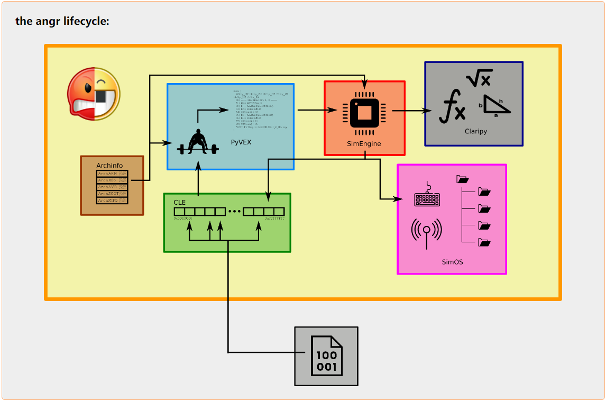
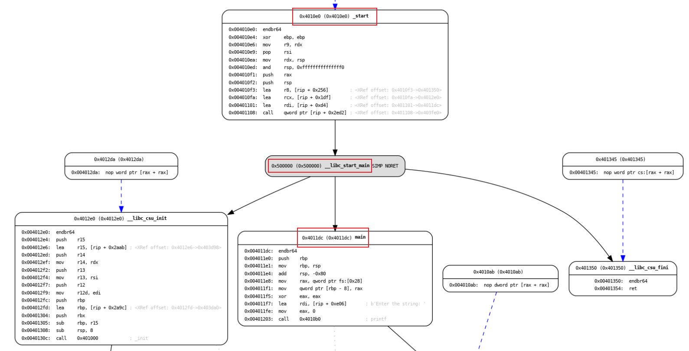
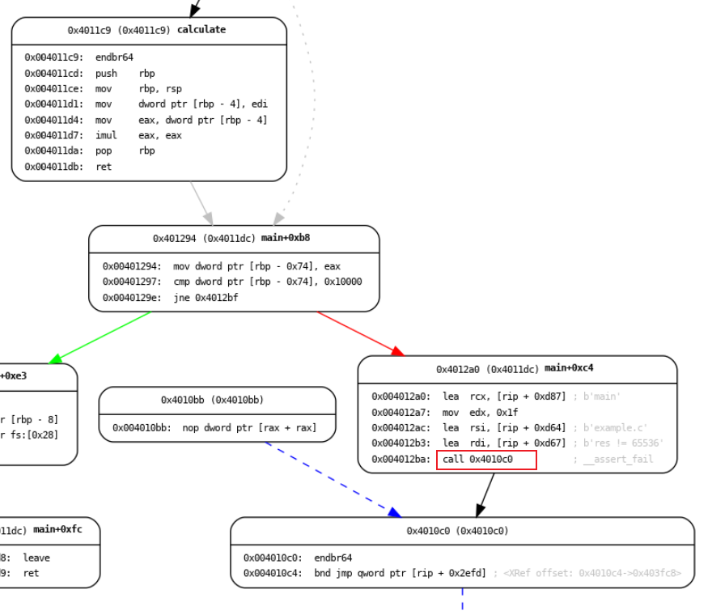

# Angr 基础

## 一、Angr简介

Angr是一个由Python语言编写的开源二进制分析框架，它主要用于静态分析、符号执行、逆向工程等安全研究领域。Angr支持多种操作系统和硬件架构，包括Windows、Linux、macOS以及x86、ARM等。


## 二、Angr整体架构

### 1、核心组件

Angr是一个复杂的二进制分析框架，其初始的整体架构设计如下图：


Angr的核心组件自下而上依次为：

1. CLE：加载可执行文件和库文件

2. archinfo：获取架构信息

3. PyVEX：将指令转换成VEX这种中间语言（IR）

4. SimuVEX：模拟执行引擎，负责在虚拟环境中执行VEX

5. Claripy：用于创建和管理符号变量及条件约束，传递给Z3求解器进行求解

6. Angr：将各个组件集成起来，提供一套整体的二进制分析和符号执行框架

7. analysis：提供一套分析工具，通过CFG、DDG等对程序进行分析

8. surveyors：用于记录和跟踪程序的可执行路径

随着Angr的发展，部分组件有更新和迭代：

- SimuVEX 被移除，其组件已集成到 Angr 中

- surveyors 被移除，被 SimulationManager 所取代
  
  

### 2、运作流程

Angr的整体运作流程如图：



使用Angr进行二进制分析时，各组件的运行步骤为：

1. CLE 加载二进制，获取机器指令

2. Archinfo 分析二进制的架构类型

3. PyVEX 根据架构类型，将机器指令转换为 VEX 中间表达

4. SimEngine 基于 VEX 来模拟程序执行

5. Clarify 创建和管理执行过程中的符号变量和约束条件，转化为 SMT 表达式，传递给 Z3 求解

6. SimOS（SimProcedures） 模拟程序与系统的交互，如标准 io 流、文件读写、系统调用等操作
   
   

## 三、Angr使用说明

### 1. 安装

Angr 需要 python 3.8 以上的运行环境，需要先装 3.8 版本以上的 python。

安装 Angr 有两种推荐方式：

- pip 安装
  
  ```shell
  pip install Angr
  ```

- 源码安装
  
  ```shell
  git clone https://github.com/Angr/Angr-dev.git
  cd Angr-dev
  ./setup.sh -i -e Angr
  ```

### 2. 运行

建议在虚拟环境中运行 Angr。源码安装的方式可以自动创建名为 Angr 的虚拟环境。手动创建虚拟环境的命令为：

```shell
python3 -m venv Angr
```

启动虚拟环境：

```shell
source Angr/bin/active
```

### 3. 使用

Angr 作为 python 的三方库，通过 import 进行调用：

```python
import Angr
```

Angr 的顶层API围绕着 Angr 的核心组件来设计，包含一组常用的 Python 类和对象，它们提供了二进制分析、符号执行和其他功能。

以下是 Angr 的一些常用 API 组件：

1. **Project（项目）**：
   
   * `Project`是 Angr 的中心组件，它代表了用户所要处理的二进制文件。
   * 创建一个`Project`实例是使用 Angr 进行分析的第一步，`Project`对象提供了对二进制文件的操作和分析的接口。

2. **Factory（工厂）**：
   
   * `Factory`对象通过`Project`的`factory`属性来访问，它提供了快速访问 Angr 的各种分析技术的接口，避免复杂的实例化操作。

3. **SimState（模拟状态）**：
   
   * `SimState`代表程序的一个瞬时状态，它包含寄存器、内存、堆栈、文件系统等运行时的上下文环境状态，可用于执行符号执行和具体执行。
   * `SimState`对象通过`Project`的`factory`属性的方法来访问，这些方法包括`entry_state`、`blank_state`、`full_init_state`等。

4. **SimulationManager（模拟管理器）**：
   
   * `SimulationManager`用来跟踪程序执行过程中的路径探索和`SimState`演化，并对这些路径和`SimState`进行管理。
   * `SimulationManager`对象通过`Project`的`factory`属性的`simulation_manager`方法实例化。

5. **Loader（加载器）**：
   
   * `Loader`负责将二进制文件载入内存，并处理符号以及它们的地址空间，为后续分析提供详细信息，如入口点、可执行段、符号表等。
   * `Loader`对象通过`Project`的`loader`属性的方法来访问。

6. **Block（块）**：
   
   * `Block`表示程序基本块，是 Angr 分析的基本单位。每个`Block`是一组顺序执行代码片段，具有原子性，以分支或跳转结尾。
   * `Block`对象通过`Project`的`factory`属性的`block`方法实例化。
     
     

## 四、Angr实践应用

example.c 源码：

```c
#include <stdio.h>
#include <string.h>
#include <stdint.h>
#include <assert.h>

#define MAX_LEN 100


int calculate(int number)
{
    return number * number;
}

int main()
{
    char input[MAX_LEN];

    printf("Enter the string: ");
    fgets(input, MAX_LEN, stdin);

    int len = strlen(input);
    int num = 0;

    for(int i = 0; i < len; i++) {
        if(input[i] >= '0' && input[i] <= '9'){
            num = num * 10 + (input[i] - '0');
        }
    }

    int res = calculate(num);
    assert(res != 65536);

    return 0;
}
```

将 example.c 编译为 example_binary ：

```shell
gcc example.c -o example_binary
```

以 example_binary 为例，演示 Angr 用法。


### 1. 静态程序分析

首先用 Angr 定位程序入口：

```python
>>> import angr
>>> project = angr.Project('example_binary', load_options={'auto_load_libs': False})
>>> project.filename
'example_binary'
>>> project.arch
<Arch AMD64 (LE)>
>>> project.entry
4198624
>>> bb = project.factory.block(4198624)
>>> bb.instructions
12
>>> hex(bb.addr)
'0x4010e0'
```

这个`0x4010e0`地址对应的是程序的入口 block ，包括12条指令，在 CFG 中表示为如下节点，可以看到 block 的名字并不是 main，而是 _start ：



接着从 _start 开始执行，执行一次后到达 ___libc_start_main ，然而再执行一次后并没有到达 main ：

```python
>>> st_0 = project.factory.entry_state()
>>> hex(st_0.addr)
'0x4010e0'
>>> nx  = st_0.step()
>>> nx.successors
[<SimState @ 0x500000>]
>>> st_1 = nx.successors[0]
>>> hex(st_1.addr)
'0x500000'
>>> nx = st_1.step()
>>> nx.successors
[<SimState @ 0x4012e0>]
```

为了获取 main 这个 block 的状态，可以使用`SimulationManager`来执行：

```python
>>> simgr = project.factory.simulation_manager(st_0)
>>> main_obj = project.loader.main_object.get_symbol('main')
>>> hex(main_obj.rebased_addr)
'0x4011dc'
>>> simgr.explore(find=main_obj.rebased_addr)
<SimulationManager with 1 found>
>>> simgr.found
[<SimState @ 0x4011dc>]
```


### 2. 静态符号执行

example_binary 接受一个最长为100位的字符串作为输入，提取字符串中的数字，转换成数值，然后进行平方运算，结果等于65536时出现断言错误。反推回来，当输入字符串中包含2、5、6这三个数字时，就能导致`AssertionError`。

要让程序自动找到触发 example_binary 中`AssertionError`的input，可以用 Angr 符号执行来求解。

首先引入`claripy`，创建符号变量：

```python
>>> import claripy
>>> input_size = 100
>>> symbolic_buffer = claripy.BVS('input', 8 * (input_size - 1))
>>> entry_state = project.factory.entry_state(stdin=claripy.Concat(symbolic_buffer, claripy.BVV(b'\n')))
```

通过 CFG 可以找到`AssertionError`的 block 地址为`0x4010c0`：



然后用`SimulationManager`控制程序朝`AssertionError`开始探索：

```python
>>> simgr = project.factory.simulation_manager(entry_state)
>>> simgr.explore(find=0x4010c0)
WARNING  | 2024-03-11 17:27:02,034 | angr.storage.memory_mixins.default_filler_mixin | The program is accessing memory with an unspecified value. This could indicate unwanted behavior.
WARNING  | 2024-03-11 17:27:03,808 | angr.storage.memory_mixins.default_filler_mixin | angr will cope with this by generating an unconstrained symbolic variable and continuing. You can resolve this by:
WARNING  | 2024-03-11 17:27:03,808 | angr.storage.memory_mixins.default_filler_mixin | 1) setting a value to the initial state
WARNING  | 2024-03-11 17:27:03,808 | angr.storage.memory_mixins.default_filler_mixin | 2) adding the state option ZERO_FILL_UNCONSTRAINED_{MEMORY,REGISTERS}, to make unknown regions hold null
WARNING  | 2024-03-11 17:27:03,808 | angr.storage.memory_mixins.default_filler_mixin | 3) adding the state option SYMBOL_FILL_UNCONSTRAINED_{MEMORY,REGISTERS}, to suppress these messages.
WARNING  | 2024-03-11 17:27:03,994 | angr.storage.memory_mixins.default_filler_mixin | Filling memory at 0x7fffffffffeff70 with 1 unconstrained bytes referenced from 0x500010 (strlen+0x0 in extern-address space (0x10))

<SimulationManager with 829 active, 20 deadended, 1 found>
>>>
>>> simgr.found
[<SimState @ 0x4010c0>]
>>> found_state = simgr.found[0]
>>> found_state
<SimState @ 0x4010c0>
>>> found_state.solver.eval(symbolic_buffer, cast_to=bytes)
b'256\x00\x00\x00\x01\x00\x00\x00\x80\x01\x00\x00\x00\x00\x00\x00\x00\x00@ \x08\x08\x00\x02\x00 \x00\x00\x80\x00\x00\x00@\x00\x01 \x02\x10\x00\x01 \x10\x00@\x04\x80\x80\x01\x80\x01@\x02\x08\x08\x04\x80\x01@\x00\x00\x00\x00\x00\x00\x00\x00\x00\x00\x00\x00\x00\x00\x00\x00\x00\x00\x00\x00\x00\x00\x00\x00\x00\x00\x00\x00\x00\x00\x00\x00\x00\x00\x00\x00\x00\x00\x00'
>>> len(found_state.solver.eval(symbolic_buffer, cast_to=bytes))
99
>>> found_state.solver.constraints
[<Bool !(input_3_792[791:784] == 10)>, <Bool !(input_3_792[783:776] == 10)>, <Bool !(input_3_792[775:768] == 10)>, <Bool !(input_3_792[767:760] == 10)>, <Bool !(input_3_792[759:752] == 10)>, <Bool !(input_3_792[751:744] == 10)>, <Bool !(input_3_792[743:736] == 10)>, <Bool !(input_3_792[735:728] == 10)>, <Bool !(input_3_792[727:720] == 10)>, <Bool !(input_3_792[719:712] == 10)>, <Bool !(input_3_792[711:704] == 10)>, <Bool !(input_3_792[703:696] == 10)>, <Bool !
……
```

可以看到虽然很慢，但是 Angr 成功地算出了一个可以触发`AssertionError`的输入。计算结果保存在`SimulationManager`的`found`属性中，每个结果是一个`SimState`实例，通过`SimState`的`solver`属性可以查看可行解与约束条件。


## 五、同类工具

| 特性\工具 | Angr           | BAP                  | Triton           | Binary Ninja   | Ghidra |
| ----- | -------------- | -------------------- | ---------------- | -------------- | ------ |
| 发布年份  | 2015           | 2011                 | 2015             | 2016           | 2019   |
| 开发语言  | Python         | OCaml (接口: C/Python) | C++ (接口: Python) | C++            | Java   |
| 模块化   | ✅              | ✅                    | ❌                | ✅              | ✅      |
| 插件系统  | ✅              | ✅                    | ❌                | ✅              | ✅      |
| 符号执行  | ✅              | ✅                    | ✅                | ❌              | ✅      |
| 污点分析  | ✅              | 部分支持                 | ✅                | ✅              | ✅      |
| 动静态分析 | 均支持            | 主要是静态分析              | 主要是动态分析          | 主要静态分析         | 均支持    |
| 形式化验证 | 有限支持           | ✅                    | ❌                | ❌              | 通过插件   |
| 中间表示  | VEX IR         | Microcode            | Triton IR        | LLIL/MLIL/HLIL | P-Code |
| 社区活跃度 | 高              | 中                    | 低                | 高              | 高      |
| 专长领域  | 全栈式分析          | 可扩展性与形式化验证           | 动态分析与污点追踪        | 逆向工程           | 逆向工程   |
| 跨平台支持 | 广泛             | 广泛                   | 有限               | 广泛             | 广泛     |
| 学习曲线  | 中等             | 较高                   | 中等               | 中等             | 中等     |
| 应用场景  | CTF/漏洞研究/二进制加固 | 安全研究/形式化验证           | 精确污点追踪/变量跟踪      | 逆向工程           | 逆向工程   |
| 开源    | ✅              | 部分开源                 | ✅                | 社区版开源          | ✅      |
