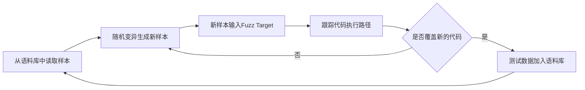

## LibFuzzer User Guide

按照[官方定义](https://llvm.org/docs/LibFuzzer.html)，LibFuzzer 是一个**in-process**（进程内的），**coverage-guided**（以覆盖率为引导的），**evolutionary**（进化的） 的 fuzz 引擎，是 LLVM 项目的一部分，主要用于对C/C++程序进行Fuzz测试。LibFuzzer三个特性的具体含义为：

- in-process：不会为每个测试用例启动一个进程，而是将所有的测试数据投放在同一个进程的内存空间中

- coverage-guided：对每一个测试输入都进行代码覆盖率计算，不断累积测试用例使得代码覆盖率最大化

- evolutionary：结合了变异和生成两种形势的Fuzz引擎
  
  - 变异：基于已有的数据样本，通过一些变异规则，产生新的测试用例
  
  - 生成：通过对目标协议或接口规范进行建模，从零开始产生测试用例

LibFuzzer与待测的library进行链接，通过向指定的fuzzing入口（即**target函数**）发送测试数据，并跟踪被触达的代码区域，然后对输入的数据进行变异，以达到代码覆盖率最大的目的，其中代码覆盖率的信息由LLVM的SanitizerCoverage工具提供。

### 一、使用方法

#### 1. 安装环境

Clang是一个类似GCC的C/C++语言编译工具，此处[简介](https://blog.csdn.net/momo0853/article/details/121040320)。LibFuzzer现在已被集成到Clang 6.0之后的版本中，在Linux环境下，只需直接安装Clang即可：

```shell
apt install clang
```

安装完毕之后，可以通过如下命令查看clang版本：

```shell
clang --version
```

#### 2. 构建target

使用LibFuzzer时，第一步就是要实现target函数——LLVMFuzzerTestOneInput，该函数以bytes数组作为输入，函数体内使用待测API对这个bytes数组进行处理：

```c++
// fuzz_target.cc
extern "C" int LLVMFuzzerTestOneInput(const uint8_t *Data, size_t Size) {
  DoSomethingInterestingWithMyAPI(Data, Size);
  return 0;  // Values other than 0 and -1 are reserved for future use.
}
```

target函数的名称、参数类型、返回值类型都不能改变。此外，官方文档中还有如下说明：

- target函数在同一个进程中被多次执行，被不同的输入循环调用；

- target函数需要容忍任何形势的输入，比如空数据、很长的数据、格式错误的数据等；

- target函数不允许调用exit函数，否则将导致Fuzz终止执行；

- target函数中可以使用线程，但是子线程要在函数体结束前join，即进入下一次循环前，结束上一次循环的子线程；

- target函数的结果必须是确定性的，即两次的Data如果一致，两次的执行结果也必须一致；

- target函数执行速度必须快，避免三阶及以上的复杂度、日志记录和过多的内存消耗；

- target函数应尽量避免修改全局状态，因为在同一个进程中修改全局变量，会导致下一次运行与上一次运行的上下文不同，可能影响程序确定性；

- target函数的处理范围越窄越好，如果函数要处理多种数据格式，那最好拆分成多个子函数，每个子函数处理一种格式。

target函数编写完成后，通过以下命令编译成可执行文件：

```shell
clang -g -O1 -fsanitize=fuzzer                         fuzz_target.cc # Builds the fuzz target w/o sanitizers
clang -g -O1 -fsanitize=fuzzer,address                 fuzz_target.cc # Builds the fuzz target with ASAN
clang -g -O1 -fsanitize=fuzzer,signed-integer-overflow fuzz_target.cc # Builds the fuzz target with a part of UBSAN
clang -g -O1 -fsanitize=fuzzer,memory                  fuzz_target.cc # Builds the fuzz target with MSAN
```

Clang支持的编译选项可以[参考文档](https://clang.llvm.org/docs/ClangCommandLineReference.html)或者通过--help查看，构建LibFuzzer target时常用的**编译选项**如下：

- -g：生成调试信息

- -O：设置编译器优化等级，可以是1/2/3，默认为1，数字越大，优化越多，注意[2和3有可能导致Fuzz找不到crash]([makefile - How to use LibFuzz on a C project that is not a library - Stack Overflow](https://stackoverflow.com/questions/74640023/how-to-use-libfuzz-on-a-c-project-that-is-not-a-library))

- **-o**：指定输出文件名

- **-I**：uppercase i，添加头文件搜索路径

- -L：添加库文件搜索路径

- -l：lowercase L，指定库文件名称，动态库和静态库同时存在时，动态库优先

- -**fsanitize**：启用LibFuzzer，对源码进行插桩，并添加各种**消毒器sanitizer**，对程序进行运行时检查。
  
  - -fsanitize=fuzzer  编译时对源码插桩，链接libFuzzer库文件（使用libFuzzer的main函数）
  
  - -fsanitize=fuzzer-no-link  编译时对源码插桩，不链接libFuzzer，适用于拥有main函数的源码。对大型项目来说，构建效率更高
  
  - -fsanitize=address  地址消毒器（[AddressSanitizer](https://clang.llvm.org/docs/AddressSanitizer.html)），用于检测缓冲区溢出、UAF、Double Free、内存泄漏等内存问题
  
  - -fsanitize=memory  内存消毒器（[MemorySanitizer](https://clang.llvm.org/docs/MemorySanitizer.html)），用于检测未初始化的内存访问
  
  - -fsanitize=undefined  未定义行为消毒器（[UndefinedBehaviorSanitizer](https://clang.llvm.org/docs/UndefinedBehaviorSanitizer.html)），用于检测程序运行中未定义行为，如越界访问、整数溢出、空指针解引用等

- -fsanitize-coverage：启用代码覆盖率的统计，包括function级别，basic block级别和edge级别，详情可[参考文档](https://clang.llvm.org/docs/SanitizerCoverage.html)。但需要注意的是，**高版本的clang中，已经取消了对-fsanitize-coverage=trace-pc-guard的支持，建议改用-fsanitize=fuzzer替代**，否则会出现报错，参见第二章节使用示例。
  
  - -fsanitize-coverage=trace-pc-guard,edge  使用edge级别代码覆盖率，edge为默认级别，可省略
  
  - -fsanitize-coverage=trace-pc-guard,func  使用function级别代码覆盖率
  
  - -fsanitize-coverage=trace-pc-guard,bb  使用basic block级别代码覆盖率

关于添加LibFuzzer相关选项后的详细构建过程，有兴趣可以参考[libFuzzer编译链接](https://i-m.dev/posts/20190831-143715.html)。

关于LibFuzzer通过插桩统计代码覆盖率的具体实现，有兴趣可以参考[Coverage Control in libFuzzer](https://cyruscyliu.github.io/posts/2021-11-02-libFuzzer-cov-control/)。

#### 3. 执行fuzz

在target函数构建成功后，会生成一个可执行的fuzz二进制文件，该文件通过命令行方式执行，可以接受指定的参数选项。执行格式为：

```shell
./fuzz-target -flag1=val1 -flag2=val2 ... path1 path2 ...
```

在不限制运行时长的情况下，Fuzz将会一直执行下去，直到出现crash（通常是因为触发sanitizer异常）才会终止。导致crash的输入将会作为能触发bug的testcase保存到磁盘上，并根据crash的类型，用不同的文件名前缀进行区分，比如crash-XXX，leak-XXX，timeout-XXX等。

##### (1) 参数说明

常见的flag选项及作用列举如下，使用flag时必须以 **-flag=val** 的格式：

| flag                     | 默认值  | 作用                                                                               |
| ------------------------ | ---- | -------------------------------------------------------------------------------- |
| verbosity                | 1    | 运行时输出详细日志                                                                        |
| seed                     | 0    | 随机种子。如果为0，则自动生成随机种子                                                              |
| runs                     | -1   | 测试运行的次数（-1表示无限）                                                                  |
| max_len                  | 0    | 测试输入的最大长度。若为0，libFuzzer会自行猜测                                                     |
| shuffle                  | 1    | 为1表示启动时打乱初始语料库                                                                   |
| prefer_small             | 1    | 为1表示打乱语料库时，较小输入更优先                                                               |
| **timeout**              | 1200 | 超时时长，单位为秒。如果单次运行超过时长，Fuzz将被终止                                                    |
| **max_total_time**       | 0    | 最大运行时长，单位为秒。若为正，表示Fuzz最长运行时间                                                     |
| help                     | 0    | 为1表示打印帮助信息                                                                       |
| **merge**                | 0    | 为1表示在不损失代码覆盖率的情况下，进行语料库合并                                                        |
| merge_control_file       | 0    | 指定合并进程的控制文件，用于恢复合并状态                                                             |
| minimize_crash           | 0    | 为1表示将提供的崩溃输入进行最小化。与-runs = N或-max_total_time = N一起使用以限制尝试次数                      |
| **jobs**                 | 0    | job的数量，多个job将被分配到workers上执行，每个job的stdout/stderr被重定向到fuzz-\<JOB\>.log             |
| **workers**              | 0    | worker的数量，为0将使用min(jobs, number_of_cpu_cores/2)                                  |
| **reload**               | 1    | 设置重新加载主语料库的间隔秒数。在并行模式下，在多个job中同步语料集。为0表示禁止                                       |
| reduce_inputs            | 1    | 为1表示尝试减少输入数据的大小，同时保留其完整的特征集                                                      |
| rss_limit_mb             | 2048 | RSS内存用量限制，单位为Mb。为0表示无限制                                                          |
| purge_allocator_interval | 1    | 清理缓存的建个时长，单位为秒。当指定rss_limit_mb且rss使用率超过50%时，开始清理。为-1表示禁止                         |
| malloc_limit_mb          | 0    | 单次malloc申请内存的大小限制，单位为Mb。为0则采用rss_limit_mb进行限制                                    |
| detect_leaks             | 1    | 为1，且启用LeakSanitizer消毒器时，将在Fuzz过程中检测内存泄漏，而不仅是在Fuzz结束时才检测                          |
| print_coverage           | 0    | 退出时打印覆盖率信息                                                                       |
| print_corpus_stats       | 0    | 退出时打印语料信息                                                                        |
| print_final_stats        | 0    | 退出时打印统计信息                                                                        |
| only_ascii               | 0    | 为1表示只生成ASCII（isprint + isspace）字符作为输入                                            |
| artifact_prefix          | 0    | 将fuzzing artifacts（crash、timeout等file）保存为文件时所使用的前缀，即文件将保存为$(artifact_prefix)file |
| exact_artifact_path      | 0    | 将单个fuzz artfifact保存为文件时所使用的前缀。将覆盖-artifact_prefix，并行任务中不要使用相同取值                  |

##### (2) 语料使用

模糊测试通过随机的方式变异或生成测试用例。提供种子语料库作为随机变异的基础用例，避免从头开始生完全随机地生成用例，在待测函数接受复杂或结构化输入的情况下，能显著提升Fuzz测试的效率和覆盖率。

LibFuzzer是以覆盖率为引导的，当提供种子语料库时，LibFuzzer从语料库中读取语料，通过随机变异产生新的测试数据，输入到Fuzz Target。由于在构建Fuzz Target时，通过编译参数进行了代码插桩，因此可以跟踪Fuzz Target在接收到输入后，具体执行了哪些代码。如果某个测试输入能执行到之前从未执行的代码，那么这个测试输入就是一个有效变异，将被纳入到语料库，作为后续变异的基础。整体流程大致如下，仅做原理示意，不等于具体实现。



使用corpus时，需要提供一个或多个存放种子语料的路径，命令为：

```shell
./fuzz_target -max_len=1000 -jobs=20 corpus_dir  # 种子语料存放在corpus_dir目录下
```

当语料库很大时，可以在保持代码覆盖率的情况下进行精简操作，这时需要用-merge参数，命令为：

```shell
./fuzz_target -merge=1 mini_corpus_dir corpus_dir  # 原始语料集存放在corpus_dir目录下，精简后的语料集存放在mini_corpus_dir目录下
```

利用-merge参数，还可以实现有效语料的提取，即从一批候选语料中，找到能够触发新代码路径的语料，命令为：

```shell
./fuzz_target -merge=1 interesting_corpus_dir candidate_corpus_dir  # 候选语料放在candidate_corpus_dir，有效语料放在interesting_corpus_dir
```

总的来说，语料集的路径可以有一个、两个或更多，当使用-merge参数时，这些语料集中发现的有效语料，都会被保存到第一个路径下。需要注意的是，合并语料是一个非常耗时的过程，通过使用-merge_control_file参数，可以实现无缝恢复的多阶段合并，即通过```killall -SIGUSR1 /path/to/fuzzer/binary```中断合并操作后，下次还能继续上一次的合并进度，继续开始合并操作。示例如下：

```shell
% rm -f SomeLocalPath
% ./my_fuzzer CORPUS1 CORPUS2 -merge=1 -merge_control_file=SomeLocalPath
...
MERGE-INNER: using the control file 'SomeLocalPath'
...
# While this is running, do `killall -SIGUSR1 my_fuzzer` in another console
==9015== INFO: libFuzzer: exiting as requested

# This will leave the file SomeLocalPath with the partial state of the merge.
# Now, you can continue the merge by executing the same command. The merge will continue from where it has been interrupted.
% ./my_fuzzer CORPUS1 CORPUS2 -merge=1 -merge_control_file=SomeLocalPath
...
MERGE-OUTER: non-empty control file provided: 'SomeLocalPath'
MERGE-OUTER: control file ok, 32 files total, first not processed file 20
...
```

语料库除了用于提高Fuzz效率，还可用于回归测试。在回归测试和复现crash时，还可以具体指定某一个testcase，命令为：

```shell
./fuzz_target testcase_path  # testcase_path就是fuzz crash时保存的testcase file的文件路径
```

#### 4. 输出解读

在Fuzz执行过程中，标准错误流stderr中，通常会输出以下格式的内容：

```vim
INFO: Seed: 1523017872
INFO: Loaded 1 modules (16 guards): [0x744e60, 0x744ea0),
INFO: -max_len is not provided, using 64
INFO: A corpus is not provided, starting from an empty corpus
#0    READ units: 1
#1    INITED cov: 3 ft: 2 corp: 1/1b exec/s: 0 rss: 24Mb
#3811 NEW    cov: 4 ft: 3 corp: 2/2b exec/s: 0 rss: 25Mb L: 1 MS: 5 ChangeBit-ChangeByte-ChangeBit-ShuffleBytes-ChangeByte-
#3827 NEW    cov: 5 ft: 4 corp: 3/4b exec/s: 0 rss: 25Mb L: 2 MS: 1 CopyPart-
#3963 NEW    cov: 6 ft: 5 corp: 4/6b exec/s: 0 rss: 25Mb L: 2 MS: 2 ShuffleBytes-ChangeBit-
#4167 NEW    cov: 7 ft: 6 corp: 5/9b exec/s: 0 rss: 25Mb L: 3 MS: 1 InsertByte-
==31511== ERROR: libFuzzer: deadly signal
...
artifact_prefix='./'; Test unit written to ./crash-b13e8756b13a00cf168300179061fb4b91fefbed
```

第一行显示Fuzz测试使用的随机种子，可以通过-seed参数来设置。

第二行显示插桩后的PC guards数量（PC指Program Counter），可理解为Fuzz识别出来的edge总数，参考[此处脚注说明](https://google.github.io/fuzzbench/reference/benchmarks/)。

第三行显示输入数据的长度限制，示例中-max_len参数没有设置，Fuzz程序将-max_len定为64，即最大数据长度不超过64kb。

第四行显示语料库信息，示例中没有提供corpus，Fuzz程序从头开始生成语料。

第五行到第十行，每行开头的#N表示Fuzz已执行了N次测试输入，后面的内容为测试过程中的事件代码和统计信息：

| 事件代码   | 含义                                                   |
| ------ | ---------------------------------------------------- |
| READ   | Fuzz已从语料库中读取所有初始输入样本                                 |
| INITED | Fuzz已完成初始化，包括通过被测代码运行每个初始输入样本                        |
| NEW    | Fuzz生成了一个测试输入样本，它能触发被测代码的新路径，将被保存到主语料库目录             |
| REDUCE | Fuzz找到了一个更好的输入样本，它能保持原有样本的特征集（参考下表ft含义），但是size更小     |
| pulse  | Fuzz已生成 2的n次方个输入（定期生成以使用户确信Fuzz仍在工作）                 |
| DONE   | Fuzz已完成操作，因为它已达到指定的迭代限制（-runs）或时间限制（-max_total_time） |
| RELOAD | Fuzz正在定期重新加载语料库目录中的输入样本，这使它能够发现其他Fuzz进程发现的任何输入       |

| 统计指标                     | 含义                                                             |
| ------------------------ | -------------------------------------------------------------- |
| cov                      | 执行当前语料库所覆盖的block或edge的总数                                       |
| ft                       | LibFuzzer使用不同的信号来评估代码覆盖率：边缘覆盖率、边缘计数器、间接调用者/被调用者对等。这些信号组合起来称为特征 |
| corp                     | 当前内存测试语料库中的条目数及其大小（单位为byte）                                    |
| lim                      | 当前语料库中新样本的长度限制。 随着时间的推移而增加，直到达到最大长度 (-max_len)                 |
| exec/s                   | 每秒Fuzz执行次数                                                     |
| rss                      | 当前内存消耗（单位为Mb）                                                  |
| L                        | 新样本的大小（单位为byte）。只用于NEW和REDUCE事件                                |
| MS: \<n\> \<operations\> | 生成新样本时的变异次数和变异方法。只用于NEW和REDUCE事件                               |

第十一行开始，显示Fuzz遇到crash并终止执行，导致crash的用例被保存为./crash-\<sha1>文件，保存路径和名称可以通过-artifact_prefix参数修改。

### 二、使用示例

以[CVE-2016-5180](https://c-ares.org/adv_20160929.html)为例，演示LibFuzzer的使用过程。[CVE-2016-5180](https://c-ares.org/adv_20160929.html)是在[c-ares](https://c-ares.haxx.se/)中出现的堆溢出问题，是使得ChromeOS被攻击（[重启后以访客模式执行代码](https://chromereleases.googleblog.com/2016/09/stable-channel-updates-for-chrome-os.html)）的漏洞之一。

#### 1. 下载源码

最新的c-ares代码已修复漏洞，为了复现漏洞，clone代码后，需要恢复到漏洞修复之前。

```git
git clone https://github.com/c-ares/c-ares.git
cd c-ares/
git reset --hard 51fbb479f7948fca2ace3ff34a15ff27e796afdd
```

#### 2. 编写Fuzz主函数

实现LLVMFuzzerTestOneInput函数，将LibFuzzer输入的字节流进行转换，调用ares_create_query函数，并将代码保存为target.cc文件。

```c++
// Copyright 2016 Google Inc. All Rights Reserved.
// Licensed under the Apache License, Version 2.0 (the "License");
#include <stdint.h>
#include <stdlib.h>
#include <string>
#include <arpa/nameser.h>

#include <ares.h>

extern "C" int LLVMFuzzerTestOneInput(const uint8_t *Data, size_t Size) {
  unsigned char *buf;
  int buflen;
  std::string s(reinterpret_cast<const char *>(Data), Size);
  ares_create_query(s.c_str(), ns_c_in, ns_t_a, 0x1234, 0, &buf, &buflen, 0);
  free(buf);
  return 0;
}
```

#### 3. 编译Fuzz target

使用[fuzzer-test-suite](https://github.com/google/fuzzer-test-suite/tree/master/c-ares-CVE-2016-5180)提供的编译脚本，执行build.sh脚本，会自动调用custom-build.sh和common.sh进行编译。三个shell脚本和Fuzz函数的存放路径如下，脚本中会自动使用git拉取代码，这里将第1步手动拉取的代码删掉了：

```shell
sqa@twtpesqa03:~/dss/fuzz$ tree
.
├── cares
│   ├── build.sh
│   └── target.cc
├── common.sh
└── custom-build.sh

1 directory, 4 files
```

注意需要将原始脚本中的-fsanitize-coverage=trace-pc-guard替换为-fsanitize=fuzzer，否则执行Fuzz时会出现错误：-fsanitize-coverage=trace-pc-guard is no longer supported by libFuzzer。

```shell
sqa@twtpesqa03:~/dss/fuzz$ ./cares-fsanitize_fuzzer
-fsanitize-coverage=trace-pc-guard is no longer supported by libFuzzer.
Please either migrate to a compiler that supports -fsanitize=fuzzer
or use an older version of libFuzzer
```

执行脚本进行编译（也可以自己编写命令进行编译，编译相关的内容之后会单独写文章进行说明）：

```shell
sqa@twtpesqa03:~/dss/fuzz$ ./cares/build.sh
```

编译完后，可以看到目录下多了一个二进制文件cares-fsanitize_fuzzer，两个目录BUILD和SRC。cares-fsanitize_fuzzer是可执行的Fuzz程序，SRC目录存放c-ares含漏洞的源码，BUILD目录用于存放编译产生的中间文件和最终文件：

```shell
sqa@twtpesqa03:~/dss/fuzz$ tree -L 1
.
├── BUILD
├── cares
├── cares-fsanitize_fuzzer
├── common.sh
├── custom-build.sh
└── SRC

3 directories, 3 files
```

#### 4. 执行Fuzz测试

直接运行编译得到的二进制文件，如需附带参数，可参考第一章节执行fuzz的参数说明。

```shell
sqa@twtpesqa03:~/dss/fuzz$ ./cares-fsanitize_fuzzer
INFO: Seed: 817252946
INFO: Loaded 1 modules   (10 inline 8-bit counters): 10 [0x5a90e0, 0x5a90ea),
INFO: Loaded 1 PC tables (10 PCs): 10 [0x56c278,0x56c318),
INFO: -max_len is not provided; libFuzzer will not generate inputs larger than 4096 bytes
INFO: A corpus is not provided, starting from an empty corpus
#2      INITED cov: 3 ft: 3 corp: 1/1b exec/s: 0 rss: 27Mb
#3      NEW    cov: 4 ft: 4 corp: 2/5b lim: 4 exec/s: 0 rss: 27Mb L: 4/4 MS: 1 CrossOver-
#10     REDUCE cov: 4 ft: 4 corp: 2/4b lim: 4 exec/s: 0 rss: 27Mb L: 3/3 MS: 2 ChangeByte-CrossOver-
#11     REDUCE cov: 4 ft: 4 corp: 2/3b lim: 4 exec/s: 0 rss: 27Mb L: 2/2 MS: 1 EraseBytes-
#1368   REDUCE cov: 6 ft: 6 corp: 3/20b lim: 17 exec/s: 0 rss: 27Mb L: 17/17 MS: 2 InsertByte-InsertRepeatedBytes-
#1524   REDUCE cov: 6 ft: 6 corp: 3/19b lim: 17 exec/s: 0 rss: 27Mb L: 16/16 MS: 1 EraseBytes-
=================================================================
==3049145==ERROR: AddressSanitizer: heap-buffer-overflow on address 0x6030012599c2 at pc 0x000000550e1c bp 0x7fffbad826d0 sp 0x7fffbad826c8
WRITE of size 1 at 0x6030012599c2 thread T0
    #0 0x550e1b in ares_create_query (/home/sqa/dss/fuzz/cares-fsanitize_fuzzer+0x550e1b)
    #1 0x55053c in LLVMFuzzerTestOneInput /home/sqa/dss/fuzz/cares/target.cc:14:3
    #2 0x4586a1 in fuzzer::Fuzzer::ExecuteCallback(unsigned char const*, unsigned long) (/home/sqa/dss/fuzz/cares-fsanitize_fuzzer+0x4586a1)
    #3 0x457de5 in fuzzer::Fuzzer::RunOne(unsigned char const*, unsigned long, bool, fuzzer::InputInfo*, bool*) (/home/sqa/dss/fuzz/cares-fsanitize_fuzzer+0x457de5)
    #4 0x45a087 in fuzzer::Fuzzer::MutateAndTestOne() (/home/sqa/dss/fuzz/cares-fsanitize_fuzzer+0x45a087)
    #5 0x45ad85 in fuzzer::Fuzzer::Loop(std::__Fuzzer::vector<fuzzer::SizedFile, fuzzer::fuzzer_allocator<fuzzer::SizedFile> >&) (/home/sqa/dss/fuzz/cares-fsanitize_fuzzer+0x45ad85)
    #6 0x44973e in fuzzer::FuzzerDriver(int*, char***, int (*)(unsigned char const*, unsigned long)) (/home/sqa/dss/fuzz/cares-fsanitize_fuzzer+0x44973e)
    #7 0x472582 in main (/home/sqa/dss/fuzz/cares-fsanitize_fuzzer+0x472582)
    #8 0x7fd31481c082 in __libc_start_main (/lib/x86_64-linux-gnu/libc.so.6+0x24082)
    #9 0x41e4dd in _start (/home/sqa/dss/fuzz/cares-fsanitize_fuzzer+0x41e4dd)

0x6030012599c2 is located 0 bytes to the right of 18-byte region [0x6030012599b0,0x6030012599c2)
allocated by thread T0 here:
    #0 0x51e20d in malloc (/home/sqa/dss/fuzz/cares-fsanitize_fuzzer+0x51e20d)
    #1 0x5508f6 in ares_create_query (/home/sqa/dss/fuzz/cares-fsanitize_fuzzer+0x5508f6)
    #2 0x55053c in LLVMFuzzerTestOneInput /home/sqa/dss/fuzz/cares/target.cc:14:3
    #3 0x4586a1 in fuzzer::Fuzzer::ExecuteCallback(unsigned char const*, unsigned long) (/home/sqa/dss/fuzz/cares-fsanitize_fuzzer+0x4586a1)
    #4 0x457de5 in fuzzer::Fuzzer::RunOne(unsigned char const*, unsigned long, bool, fuzzer::InputInfo*, bool*) (/home/sqa/dss/fuzz/cares-fsanitize_fuzzer+0x457de5)
    #5 0x45a087 in fuzzer::Fuzzer::MutateAndTestOne() (/home/sqa/dss/fuzz/cares-fsanitize_fuzzer+0x45a087)
    #6 0x45ad85 in fuzzer::Fuzzer::Loop(std::__Fuzzer::vector<fuzzer::SizedFile, fuzzer::fuzzer_allocator<fuzzer::SizedFile> >&) (/home/sqa/dss/fuzz/cares-fsanitize_fuzzer+0x45ad85)
    #7 0x44973e in fuzzer::FuzzerDriver(int*, char***, int (*)(unsigned char const*, unsigned long)) (/home/sqa/dss/fuzz/cares-fsanitize_fuzzer+0x44973e)
    #8 0x472582 in main (/home/sqa/dss/fuzz/cares-fsanitize_fuzzer+0x472582)
    #9 0x7fd31481c082 in __libc_start_main (/lib/x86_64-linux-gnu/libc.so.6+0x24082)

SUMMARY: AddressSanitizer: heap-buffer-overflow (/home/sqa/dss/fuzz/cares-fsanitize_fuzzer+0x550e1b) in ares_create_query
Shadow bytes around the buggy address:
  0x0c06802432e0: fa fa fa fa fa fa fa fa fa fa fa fa fa fa fa fa
  0x0c06802432f0: fa fa fa fa fa fa fa fa fa fa fa fa fa fa fa fa
  0x0c0680243300: fa fa fa fa fa fa fa fa fa fa fa fa fa fa fa fa
  0x0c0680243310: fa fa fa fa fa fa fa fa fa fa fa fa fa fa fa fa
  0x0c0680243320: fa fa fa fa fa fa fa fa fa fa fd fd fd fa fa fa
=>0x0c0680243330: fd fd fd fa fa fa 00 00[02]fa fa fa fd fd fd fa
  0x0c0680243340: fa fa fd fd fd fa fa fa fd fd fd fa fa fa fd fd
  0x0c0680243350: fd fa fa fa fd fd fd fa fa fa fd fd fd fa fa fa
  0x0c0680243360: fd fd fd fa fa fa fd fd fd fa fa fa fd fd fd fa
  0x0c0680243370: fa fa fd fd fd fa fa fa fd fd fd fa fa fa fd fd
  0x0c0680243380: fd fa fa fa fd fd fd fa fa fa fd fd fd fa fa fa
Shadow byte legend (one shadow byte represents 8 application bytes):
  Addressable:           00
  Partially addressable: 01 02 03 04 05 06 07
  Heap left redzone:       fa
  Freed heap region:       fd
  Stack left redzone:      f1
  Stack mid redzone:       f2
  Stack right redzone:     f3
  Stack after return:      f5
  Stack use after scope:   f8
  Global redzone:          f9
  Global init order:       f6
  Poisoned by user:        f7
  Container overflow:      fc
  Array cookie:            ac
  Intra object redzone:    bb
  ASan internal:           fe
  Left alloca redzone:     ca
  Right alloca redzone:    cb
  Shadow gap:              cc
==3049145==ABORTING
MS: 4 ChangeByte-InsertByte-CopyPart-ChangeByte-; base unit: 00b28ff06b788b9b67c6b259800f404f9f3761fd
0x5c,0x2e,0x0,0x6b,0x0,
\\.\x00k\x00
artifact_prefix='./'; Test unit written to ./crash-edef708d314ed627eba0ef2b042e47aa96a9b899
Base64: XC4AawA=
```

可以看到，LibFuzzer发现了c-ares中的heap-buffer-overflow漏洞，触发crash的用例保存为crash-edef708d314ed627eba0ef2b042e47aa96a9b899文件，该用例包含5个字节，字节码分别为：0x5c,0x2e,0x0,0x6b,0x0，其中0x0为空字符NULL，属于不可见字符。

#### 5. 提取语料

执行Fuzz时，传入一个空文件夹作为copus路径，执行完后，可以在文件夹中看到LibFuzzer执行过程中，生成的有效语料。

```shell
sqa@twtpesqa03:~/dss/fuzz/cares$ mkdir corpus
sqa@twtpesqa03:~/dss/fuzz/cares$ ls
BUILD  build.sh  cares_fuzzer  corpus  target.cc
sqa@twtpesqa03:~/dss/fuzz/cares$ ./cares_fuzzer corpus/
INFO: Seed: 4140748905
INFO: Loaded 1 modules   (57 inline 8-bit counters): 57 [0x5a9100, 0x5a9139),
INFO: Loaded 1 PC tables (57 PCs): 57 [0x5a9140,0x5a94d0),
INFO:        0 files found in corpus/
INFO: -max_len is not provided; libFuzzer will not generate inputs larger than 4096 bytes
INFO: A corpus is not provided, starting from an empty corpus
#2      INITED cov: 13 ft: 14 corp: 1/1b exec/s: 0 rss: 27Mb
#4      NEW    cov: 16 ft: 20 corp: 2/3b lim: 4 exec/s: 0 rss: 27Mb L: 2/2 MS: 2 ChangeByte-InsertByte-
#9      NEW    cov: 16 ft: 26 corp: 3/6b lim: 4 exec/s: 0 rss: 27Mb L: 3/3 MS: 5 ChangeBit-ChangeByte-ChangeByte-CopyPart-InsertByte-
#10     NEW    cov: 16 ft: 32 corp: 4/10b lim: 4 exec/s: 0 rss: 27Mb L: 4/4 MS: 1 CrossOver-
#25     NEW    cov: 18 ft: 34 corp: 5/11b lim: 4 exec/s: 0 rss: 27Mb L: 1/4 MS: 5 ChangeBit-ChangeASCIIInt-CMP-CrossOver-EraseBytes- DE: "\x01\x00"-
#94     NEW    cov: 19 ft: 35 corp: 6/15b lim: 4 exec/s: 0 rss: 27Mb L: 4/4 MS: 4 CrossOver-ShuffleBytes-ChangeByte-ChangeBit-
#108    NEW    cov: 21 ft: 37 corp: 7/16b lim: 4 exec/s: 0 rss: 27Mb L: 1/4 MS: 4 ChangeByte-ShuffleBytes-ChangeBit-ChangeByte-
#125    NEW    cov: 22 ft: 38 corp: 8/18b lim: 4 exec/s: 0 rss: 27Mb L: 2/4 MS: 2 ShuffleBytes-InsertByte-
...
==3237059==ABORTING
MS: 2 InsertRepeatedBytes-ChangeByte-; base unit: 1bef8aac927d18852642a96c20e50efba80fdfae
0x5c,0x5,0x98,0x98,0x98,0x98,0x98,0x98,0x98,0x98,0x98,0x98,0x98,0x5c,0x2e,
\\\x05\x98\x98\x98\x98\x98\x98\x98\x98\x98\x98\x98\\.
artifact_prefix='./'; Test unit written to ./crash-157768d6f06d94325fe0e6bcf66cbd2d27dd8db7
Base64: XAWYmJiYmJiYmJiYmFwu
sqa@twtpesqa03:~/dss/fuzz/cares$ ls -al
total 2244
drwxrwxr-x 4 sqa sqa    4096 Sep 26 17:47 .
drwxrwxr-x 5 sqa sqa    4096 Sep 26 15:25 ..
drwxrwxr-x 9 sqa sqa   20480 Sep 26 17:18 BUILD
-rw-rw-r-- 1 sqa sqa     722 Sep 26 17:13 build.sh
-rwxrwxr-x 1 sqa sqa 2250720 Sep 26 17:18 cares_fuzzer
drwxrwxr-x 2 sqa sqa    4096 Sep 26 17:47 corpus
-rw-rw-r-- 1 sqa sqa      15 Sep 26 17:47 crash-157768d6f06d94325fe0e6bcf66cbd2d27dd8db7
-rw-rw-r-- 1 sqa sqa     499 Sep 26 17:14 target.cc
sqa@twtpesqa03:~/dss/fuzz/cares$ ls corpus/
08534f33c201a45017b502e90a800f1b708ebcb3  5175b74bd75b8d90a01f77709deba3982fbbdcb2  78bdce51613f555049a9937095bf469bcb77e94f  be566cb17d3bce0b2a8e5e710b3779df720db1f5
0f1c5448bf80343eeac759f8adcbdc2720533d15  5318c4ac20dac95a702bee2e27834d39ea6bc2b6  8e54ed049741d7cf6fb8ef7f4288ef0be3b54f17  be5c29e07560abcf094c3419712a01590bbe8594
0fe509b10d833be6eb3d5ed4947cbe0fbb64ed84  5ba93c9db0cff93f52b521d7420e43f6eda2784f  8ea51a3719d7cbfc3e2dcd3edf6109918d5aad55  caea31b9ef76b9be352ad1054956efbb86d4451a
1bef8aac927d18852642a96c20e50efba80fdfae  60321f72401b49b895535045eb8d3b9ca7db7c7c  91a3f7c503955600f5dac12c1c1a3c5b674a4d98  dea712be0e801f4502a21e04dfbec5bd0cbc677c
24792aa3923c4cd185519d3d445ecfd0801db1c1  6380a9a2d2701df0cb53d880842747cbefef8a5d  9f64357cb30f24cf567513e140e9fb0cbf1a2be5  e716589d09e16cf4a48d2c7f1d357bb481aaf3bc
3a52ce780950d4d969792a2559cd519d7ee8c727  6414bd7955e39106721edf7cc29efdb82f7007ac  b534844fd943d8b338025ad82d68283f1bcdb5c0
```

#### 6. 合并语料

当Fuzz执行很久之后，会产生大量语料。为了减少语料数量，可以使用merge参数进行合并。创建一个min_corpus目录，执行Fuzz时，启动merge参数，传入min_corpus目录和corpus目录，合并完后，可以在min_corpus目录下看到缩减之后的语料。以下示例显示预料数据从31个减少到29个：

```shell
sqa@twtpesqa03:~/dss/fuzz/cares$ mkdir min_corpus
sqa@twtpesqa03:~/dss/fuzz/cares$ ./cares_fuzzer -merge=1 min_corpus/ corpus/
INFO: Seed: 1671146211
INFO: Loaded 1 modules   (57 inline 8-bit counters): 57 [0x5a9100, 0x5a9139),
INFO: Loaded 1 PC tables (57 PCs): 57 [0x5a9140,0x5a94d0),
MERGE-OUTER: 31 files, 0 in the initial corpus, 0 processed earlier
MERGE-OUTER: attempt 1
INFO: Seed: 1671165588
INFO: Loaded 1 modules   (57 inline 8-bit counters): 57 [0x5a9100, 0x5a9139),
INFO: Loaded 1 PC tables (57 PCs): 57 [0x5a9140,0x5a94d0),
INFO: -max_len is not provided; libFuzzer will not generate inputs larger than 1048576 bytes
MERGE-INNER: using the control file '/tmp/libFuzzerTemp.3327149.txt'
MERGE-INNER: 31 total files; 0 processed earlier; will process 31 files now
#1      pulse  cov: 9 ft: 10 exec/s: 0 rss: 27Mb
#2      pulse  cov: 13 ft: 14 exec/s: 0 rss: 27Mb
#4      pulse  cov: 20 ft: 22 exec/s: 0 rss: 27Mb
#8      pulse  cov: 28 ft: 38 exec/s: 0 rss: 27Mb
#16     pulse  cov: 29 ft: 56 exec/s: 0 rss: 27Mb
#31     DONE   cov: 29 ft: 82 exec/s: 0 rss: 28Mb
MERGE-OUTER: succesfull in 1 attempt(s)
MERGE-OUTER: the control file has 2691 bytes
MERGE-OUTER: consumed 0Mb (27Mb rss) to parse the control file
MERGE-OUTER: 29 new files with 82 new features added; 29 new coverage edges
```

### 三、优化技巧

整体优化思路分两种：

1. 找到crash更快 --> 并行化，多个实例一起运行
2. 覆盖edge更多 --> 加强语料，让输入能走到更深的分支

#### （一）并行化

##### 1、LibFuzzer

**(1) jobs和workers**

* jobs：指定 fuzz 实例的数量。在不设置运行时长的情况下，每个 fuzz 实例找到 crash 才会停止。理论上有多少jobs，最后会产生多少个crash文件。但实际上，不同的job可能找到同样的crash，最后crash文件个数少于job个数。
* works：执行 fuzz 进程的数量。在多个 jobs 的情况下，平均每个woker执行#jobs/#workers个job。

简单来说，使用 workers 能提升fuzz运行速度，使用 jobs 能增加 crash 数量（仅根据输入去重，没有对调用栈去重）。 只使用 jobs 的情况下，默认开启 min(#jobs, #cores) // 2 个workers。

**(2) fork**

目前 fork 是实验阶段的参数，计划最终使用 fork 代替 jobs 和 workers 来实现 LibFuzzer 的并行化。

* fork：父进程不直接执行 fuzz，而是开启N个子进程，每个子进程使用语料库的随机子集进行 fuzz，当子进程退出后，该子进程的语料将被合并到主语料库中。子进程可以通过设置参数，来实现对指定错误的容错能力：

* -ignore_ooms：默认为True。子进程发生内存溢出时，保存输入用于重现，但 fuzz 继续执行。

* -ignore_timeouts：默认为True。子进程发生超时时，保留输入用于重现，但 fuzz 继续执行。

* -ignore_crashes：默认为False。子进程发生其他类型 crash 时，保留输入用于重现，但 fuzz 继续执行。

##### 2、LibFuzzer结合AFL

AFL 可以支持 LibFuzzer 的 target，编译方法参考[此处说明](https://link.zhihu.com/?target=https%3A//github.com/llvm/llvm-project/blob/main/compiler-rt/lib/fuzzer/afl/afl_driver.cpp)。

```shell
afl-fuzz -i testcase_dir -o findings_dir ./fuzz-target @@ 
./fuzz-target testcase_dir findings_dir # Will write new tests to testcase_dir
```

需要定期重启 AFL 和 LibFuzzer，以完成语料同步。

#### （二）加强语料

##### 1、字典

运行时使用-dict参数指定字典（Dictionary）文件的路径，字典用于指定和控制模糊测试中输入数据的一部分，从而提高模糊测试的效果。

字典文件：

```shell
# Lines starting with '#' and empty lines are ignored.

# Adds "blah" (w/o quotes) to the dictionary.
kw1="blah"
# Use \\ for backslash and \" for quotes.
kw2="\"ac\\dc\""
# Use \xAB for hex values
kw3="\xF7\xF8"
# the name of the keyword followed by '=' may be omitted:
"foo\x0Abar"
```

使用方法（运行时）：

```shell
./fuzz-target -dict=dict_file
```

##### 2、CMP

编译时使用-fsanitize-coverage=trace-cmp参数，让 fuzz 拦截 CMP 指令（例如 if 语句中的 compare 条件）并根据拦截到的 CMP 指令的参数来引导变异。这可能会减慢模糊测试的速度，但很可能会改善测试结果。

使用方法（编译时）：

```shell
clang++ buggy.cc -fsanitize=fuzzer,address -fsanitize-coverage=trace-cmp -g -o buggy-fuzzer
```

##### 3、Value Profile

需要与`-fsanitize-coverage=trace-cmp`一起使用，让 fuzz 收集 CMP 指令的参数值进行分析，用于发现更多的有效输入。但是有两个缺点：首先可能会导致速度降低2倍。 其次语料库可能增长数倍。

使用方法（运行时）：

```shell
./fuzz-target -use_value_profile=1
```

##### 4、Fuzzer-friendly build mode

程序中可能存在某些对 fuzz 不友好的特性，例如：

* 随机化：同一个输入，可能走不同的路径
* 校验和：拦截无效输入

此时可以用构建宏FUZZING_BUILD_MODE_UNSAFE_FOR_PRODUCTION来编译一个对 fuzz 友好的版本，使用时需要对源码进行修改。例如：

```c
void MyInitPRNG() {
#ifdef FUZZING_BUILD_MODE_UNSAFE_FOR_PRODUCTION
  // In fuzzing mode the behavior of the code should be deterministic.
  srand(0);
#else
  srand(time(0));
#endif
}
```

### 四、 参考资料

1. [libFuzzer – a library for coverage-guided fuzz testing](https://llvm.org/docs/LibFuzzer.html#fuzzer-friendly-build-mode)
2. [libFuzzer使用总结教程](https://bbs.kanxue.com/thread-274792.htm)
3. [Efficient Fuzzing Guide](https://chromium.googlesource.com/chromium/src/+/main/testing/libfuzzer/efficient_fuzzing.md)
4. [The art of fuzzing-A Step-by-Step Guide to Coverage-Guided Fuzzing with LibFuzzer](https://aviii.hashnode.dev/the-art-of-fuzzing-a-step-by-step-guide-to-coverage-guided-fuzzing-with-libfuzzer)
5. [An introduction to LLVM libFuzzer](https://www.moritz.systems/blog/an-introduction-to-llvm-libfuzzer/)
6. [An informative guide on using AFL and libFuzzer](https://www.withsecure.com/se-sv/expertise/blog-posts/super-awesome-fuzzing-part-one)
7. [libfuzzer-workshop](https://github.com/Dor1s/libfuzzer-workshop)
8. [Sanitizers](https://github.com/google/sanitizers)
9. [The Magic Behind Feedback-Based Fuzzing](https://www.code-intelligence.com/blog/the-magic-behind-feedback-based-fuzzing)
