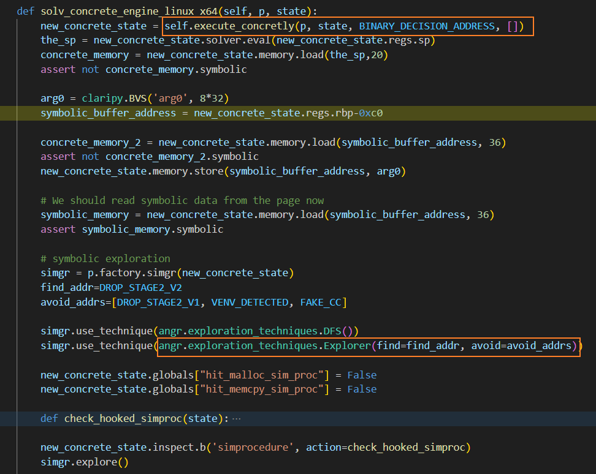

# Symbion初探

## 一、原理

原始论文：[SYMBION: Interleaving Symbolic with Concrete Execution](https://seclab.cs.ucsb.edu/files/publications/gritti2020_symbion.pdf)

官方博客：[symbion: fusing concrete and symbolic execution](https://angr.io/blog/angr_symbion/)

### 1. 背景

符号执行可以用来获取走到指定程序区块的可行输入，但是符号执行在实际应用中面临很多挑战：

1. 路径爆炸问题：符号执行从程序入口开始探索，当程序中出现分支和循环时，会导致路径状态呈指数增长。

2. 环境交互问题：当程序与系统或三方库进行交互时，由于缺失源码或交互复杂等原因，会阻碍符号执行的状态更新。
   
   

### 2. 方案

Symbion 通过具体执行环境与符号执行环境的同步与切换，实现具体值和符号值交替执行。通过这种交替执行机制，减少符号执行探索的路径状态，并解决程序对外部环境的依赖问题。

图中演示了具体执行环境与符号执行环境相互切换的过程：

目标是对从 PoI 到 TP 的路径进行符号推理，CSP 节点是程序入口。从 CSP 到 PoI 要经过复杂的运算和交互，这导致直接从 CSP 开始符号推理，将无法向后演进到 PoI 。

使用 Symbion 时，首先将具体值输入给 CSP，在具体执行后到达 PoI 。然后在 PoI 切换到符号执行环境，算出到达 TP 所需的变量取值。再将算出来的结果同步给具体执行环境，在 PoI 恢复具体执行，即可到达 TP 。

### 3. 实现

Symbion 的架构设计如下：

Symbion 在 Angr 的基础上，增加了如下组件：

- Concrete Target：定义了与具体执行环境交互的方法，通过实现这些方法可以让 Symbion 支持特定的交互环境。例如 Symbion 实现的GDBConcreteTarget，它通过 gdbsever 控制远程目标程序的交互。
  
  * read_memory(address, nbytes)：从具体进程内存中 address 开始读取 nbytes 字节。
  * write_memory(address, value)：在具体进程内存中 address 处写入 value。
  * read_register(register)：返回具体进程中指定 register 的内容。
  * write_register(register, value)：在具体进程的 register 中写入 value。
  * set_breakpoint(address)：在具体进程中的 address 处设置断点。
  * remove_breakpoint(address)：移除之前在 address 处设置的断点。
  * run()：恢复具体进程的执行。

- SimEngineConcrete：利用 Concrete Target 的方法执行以下步骤，实现 Symbolic 环境到 Concrete 环境的切换。
  
  * 用用户提供的值修改具体进程的内存。
  * 用用户提供的值修改具体进程的寄存器。
  * 通过断点来设置新的 PoI 。
  * 恢复程序的具体执行，直到到达新的 PoI ，并将控制权交还给 Angr。

- Concrete SimPlugin：当具体执行到达 PoI ，这个插件实现 Concrete 环境到 Symbolic 环境的切换，它将具体状态导入 Angr 来创建 SimState 。
  
  - 将 SimState 的内存后端重定向到具体进程的内存，即在符号执行过程中， SimState 的内存读取都是从具体进程中来操作。
  
  - 将具体进程中的寄存器值复制到 SimState 中。
  
  - 将具体进程的内存映射与 Angr 在启动期间加载的内存映射同步。

- SYMBION Exploration Technique：提供用户使用 Symbion 的 API ，通过这些 API ，用户指定 PoI 的地址，在具体执行到达 PoI 后，Symbion 切换为符号执行。
  
  

简而言之，在 Symbion 的工作流程中，各组件的作用为：

1. 用户通过 SYMBION Exploration Technique 指定 PoI。

2. 程序经过具体执行到达到 PoI 后暂停， Concrete SimPlugin 根据具体执行环境来创建一个 SimState 。

3. Angr 通过符号执行，计算到达下一个 PoI 的可行解。

4. SimEngineConcrete 用 Angr 算出来的结果修改具体进程中的变量，恢复具体执行直到下一个 PoI 。
   
   

## 二、示例

Symbion 官方示例：[test_concrete_not_packed_elf64](https://github.com/angr/angr-targets/blob/master/tests/test_concrete_not_packed_elf64.py)

示例使用的二进制：[not_packed_elf64](https://github.com/angr/binaries/blob/master/tests/x86_64/not_packed_elf64)

二进制没有给源码，通过 IDA 逆向源码，并用 AI 改写，得到 C 源码如下，源码中取 dest 变量中的一串数值做判断，不同的分支触发不同的 print 。

在 Symbion 的示例代码中，首先通过具体执行到达 BINARY_DECISION_ADDRESS ，然后用符号执行探索从 BINARY_DECISION_ADDRESS 到 DROP_STAGE2_V2 的路径。

在符号执行求解成功后，再将求解结果传递给具体执行环境，并启动具体执行，即可到达 DROP_STAGE2_V2 ：

结合 CFG 和源码可以看到，符号执行的起点 BINARY_DECISION_ADDRESS 对应源码图右侧 55 行，符号执行的终点 DROP_STAGE2_V2 对应源码图右侧 77 行。通过 Symbion，实现了对二进制按指定路径的进行分析的目的。

Symbion 的示例代码中，涉及到很多内存地址操作，需要结合 IDA 的反编译源码来看：

- line 2：启动具体执行，到 BINARY_DECISION_ADDRESS 停下，即 IDA 反编译源码第 67 行代码

- line 3：从具体执行环境的获取寄存器中的栈指针 sp ，指向栈顶（即栈开始的位置）

- line 4：从栈顶 sp 开始读取 20 个字节的内存，对应反编译源码中的变量 v6

- line 5：判断是否为符号变量，此时为具体执行环境，所以不是符号变量

- line 7：定义符号变量，变量名为 arg0 ，大小为 32 字节

- line 8：用 symbolic_buffer_memory 指向具体执行环境中 rbp-0xc0 的内存地址，它对应 IDA 反编译源码中的数组 s 的起始地址。

- line 10：从 symbolic_buffer_memory 开始加载 36 个字节的内存

- line 11：判断是否为符号变量，此时为具体执行环境，所以不是符号变量

- line 12：将 angr0 存储到 symbolic_buffer_memory ，将符号变量与具体执行环境的内存地址关联起来

- line 15：从 symbolic_buffer_memory 开始加载 36 个字节的内存

- line 16：判断是否为符号变量，因为 把 angr0 保存到这块内存，所以是符号变量

- line 19：符号执行状态初始化

- line 37：启动符号执行
  
  

