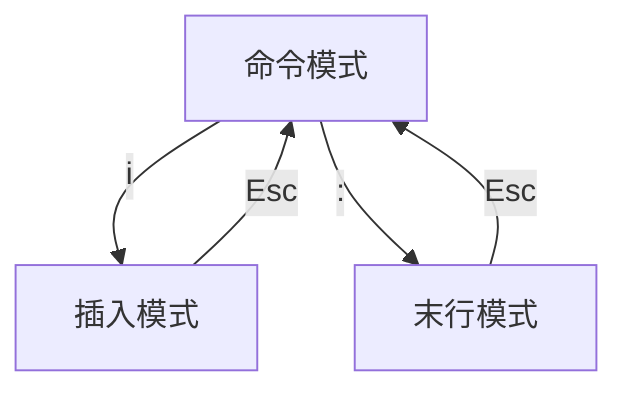
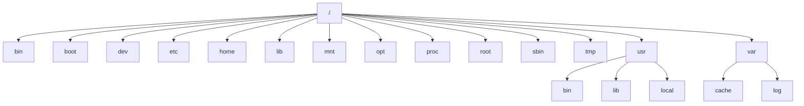

## 一、引言
操作系统有个内核，负责管理系统的进程、内存、设备、文件和网络等资源。操作系统还有个shell，为用户提供与内核交互的途径。shell可以分为GUI（图形界面）和CLI（命令行）两种，GUI以windows为代表，CLI以linux为代表。linux也有Gnome桌面，但效率和性能不如CLI，学linux必学CLI。

CLI是用户与内核打交道的工具。用户日常使用操作系统，最频繁的场景就是文件操作和网络访问。故而基础篇笔记主要记录CLI基本操作、文件系统、网络配置、权限管理等相关知识点。

## 二、CLI基本操作
### （一）查看目录
ls：显示指定目录下的文件及属性信息

pwd：显示当前工作目录的路径

### （二）查看内容
echo：输出字符串或变量值（变量前加$符号）

cat：输出文件内容

head：查看文件头部内容

tail：查看文件尾部内容，-f将持续追踪文件尾部追加的内容

more：分页显示文件内容，只能向后翻页，不能往前回翻

less：分页显示文件内容，可以向后看，也可以向前看

### （三）开关机
shutdown：按指定方式关闭系统

poweroff：关机

reboot：重启

### （四）归档压缩
zip：打包成zip文件

unzip：zip文件解包

tar：压缩和解压缩文件

### （五）文件和目录操作
locate：基于数据库快速查找文件和目录，手动更新数据库使用updatedb命令

find：根据条件在指定目录下查找文件和目录

cp：复制文件或目录

mv：移动文件或目录

cd：切换目录

mkdir：创建目录

touch：创建空文件

rm：删除文件或目录

rmdir：删除空目录

### （六）进程操作
&：命令+空格+&，会将任务置于后台执行

jobs：查看后台任务

fg：将后台任务放到前台执行

bg：将前台任务放到后台执行，前台任务可通过ctrl+z暂停

ps：查看系统当前的进程状态

kill：终止进程

### （七）命令帮助
history：查看历史命令记录

man：查看命令的帮助手册，一般情况下命令加-h或--help够用了

### （八）文本编辑
grep：搜索文本，可使用关键字或正则表达式

sed：编辑文本，可使用正则表达式或脚本

cut：基于列处理文件内容

wc：统计文件行数、单词数、字符数等信息

diff：比较文件内容差异

vim：linux最常用的文本编辑工具，使用时分为三种模式（命令模式，插入模式，末行模式），各种模式切换方式如图

**vim命令模式常用命令：**
dd：剪切光标所在整行

yy：复制光标所在整行

p：将剪切或复制内容粘贴到光标处

o：插入新行

u：撤销上一步操作

n：定位到搜索结果的下一个字符串

N：定位到搜索结果的上一个字符串

**vim末行模式常用命令：**
:w 保存修改

:q 退出vim

:q! 放弃修改，强制退出vim

:x 保存并退出vim

:set nu 显示行号

:set nonu 不显示行号

:整数 跳转到指定行

:/字符串 搜索字符串

### （九）管道和重定向
linux的标准数据流包括输入流stdin(0)、输出流stdout(1)、错误流stderr(2)，默认情况下stdin接受键盘输入，stdout和stderr将结果和错误输出到命令行终端。

通过管道和重定向操作符，可以控制标准数据流的来源和去向：
| 分类 | 操作符 | 定义 | 示例 |
| ------------ | ------------ | ------------ | ------------ |
| 重定向 | > | 将stdout输出到文件（覆盖模式） | echo 'test' > file |
| 重定向 | >> | 将stdout输出到文件（追加模式） | echo 'test' >> file |
| 重定向 | 2>  | 将stderr输出到文件（覆盖模式） | cd /dev/null > file |
| 重定向 | 2>&1 | 将stderr和stdout输出到文件（覆盖模式） | cd /dev/null 2>&1 file |
| 重定向 | < | 将文件输入到stdin | grep user < file |
| 管道 | &#124 | 将前一个命令的stdout作为后一个命令的stdin | echo 'hello world' &#124 grep 'hello' |

## 三、文件系统
### （一）linux文件目录结构
linux下一切皆文件（普通文件、目录文件、设备文件、管道文件……），linux文件系统不区分磁盘（windows通常分C盘D盘，cmd切换跨盘目录时，需要先切换盘符），整个linux系统目录是以/为根节点的单根树结构，遵循FHS标准规范：

各目录的简要说明如下：
> / 根目录
> 
> /bin 存放二进制可执行文件，root用户和普通用户都能使用
> 
> /boot 存放linux启动时的引导程序
> 
> /dev linux的设备也是以文件形式组织，存放在此目录下
> 
> /etc 存放linux的系统管理和配置文件
> 
> /home 存放普通用户的家目录，类似于windows下C盘Users用户文件夹
> 
> /lib 存放程序运行依赖的库文件和内核驱动模块
> 
> /mnt 设备挂载目录
> 
> /opt 三方软件或大型软件的安装目录
> 
> /proc 虚拟文件系统，记录系统实时信息，只存在内存中，不占用磁盘空间
> 
> /root root用户的家目录
> 
> /sbin 存放二进制文件，仅root用户有权限使用
> 
> /tmp 临时目录，重启系统会自动删除
> 
> /usr 不是user缩写，是unix software resource缩写，存放系统上安装的软件资源
> 
> /var 存放系统中经常变动的文件，如缓存cache、日志log、邮件mail等

### （二）分区-格式化-挂载
linux添加一个新的磁盘设备时，由于linux一切皆文件，需要将磁盘格式化为指定的文件系统，然后挂载到linux的系统目录中才能使用。相关的常用命令如下：
> df：查看系统上磁盘的使用情况
> 
> fdisk：磁盘分区工具，只支持MBR类型
> 
> parted：磁盘分区工具，支持MBR和GPT
> 
> mkfs：格式化文件系统（包括ext2、ext3、ext4、xfs、btrfs等）
> 
> mount：把文件系统挂载到指定系统目录，重启后挂载失效，永久挂载需修改/etc/fstab配置
> 
> umount：卸载文件系统，如果文件系统正在使用，会出现device busy问题
> 
> fuser：查看使用文件系统的进程
> 
> lsof：查看被打开的文件

## 四、权限管理
### （一）用户和组
linux是服务器的主流操作系统，服务器通常由很多人同时使用。为不同的用户分配各自的操作权限，对维护系统的安全和稳定来说是十分必要的。

linux的用户分为root用户、系统用户和普通用户，每个用户用唯一的uid标识，root用户的uid为0，系统用户的uid通常在1~999，普通用户的uid通常>=1000。系统用户主要用于执行系统程序，无法使用shell登录。

为了便于对用户进行管理，每个用户还有对应的用户组，包括主组和附加组，主组只能有一个，附加组可以有多个。默认情况下，创建用户时，会将用户归属于同名的主组。

linux上用户和用户组的信息都保存在/etc目录下，相关命令和文件说明如下：
> id：显示用户与用户组信息
> 
> passwd：修改用户密码
> 
> useradd：创建用户
> 
> groupadd：创建用户组
> 
> userdel：删除用户
> 
> groupdel：删除用户组
> 
> /etc/passwd：用户账号信息
> 
> /etc/shadow：用户密码信息（已加密）
> 
> /etc/group：用户组信息

### （二）普通权限
linux定义的普通权限有r（读）w（写）x（执行）三种，对文件来说很容易理解，对文件夹来说，要浏览目录需要同时开启r和x权限，x表示可以通过cd进入目录。

linux通过UGO模型对文件进行权限控制，其中U（user）表示文件所属用户，G（group）表示文件所属用户组，O（other）表示既不是所属用户也不是所属用户组的其他群体。

通过ls -l查看文件权限如上图所示，第一列权限信息包含10位字符，第三列表示文件所属用户（属主），第四列表示文件所属用户组（属组）。权限信息中，第1个字符表示文件类型（-表示文件，d表示文件夹，l表示符号链接），后面9个字符每3个一组，分别描述属主（user）权限、属组（group）权限、其他（other）权限。权限位是rwx表示具有相应权限，权限位是-表示没有相应权限。除了以字符的方式，每组权限还可以用3个bit位来表示，r在高位，w在中位，x在低位，于是rwx=b111=4+2+1=7。在修改权限时，可以使用任一种表达方式。

在创建文件或文件夹时，系统会设定默认的权限，通过原始权限减去权限掩码的方式，可以得到默认权限。文件夹的原始权限是777（rwxrwxrwx），文件的原始权限是666（rw-rw-rw-）。普通用户的默认掩码是002，root用户的默认掩码是022。因此，对普通用户来说，新建文件夹的权限是775（rwxrwxr-x），新建文件的权限是664（rw-rw-r--）。

常用的权限修改命令如下：
> chown：修改文件的属主
> 
> chgrp：修改文件的属组
> 
> chmod：修改文件的权限
> 
> umask：管理权限掩码

### （三）特殊权限
除了rwx三种普通权限外，还有三种特殊权限：

| 权限 | 对文件影响 | 对目录影响 |
| ------------ | ------------ | ------------ |
| suid | 以文件所属用户的权限执行，而非执行文件的用户权限 | 无 |
| sgid | 以文件所属用户组的权限执行（用法较少） | 该目录中创建的任意新文件的所属组与该目录的所属组相同 |
| sticky | 无 | 对目录拥有写入权限的用户仅能删除该用户拥有的文件，无法删除其他用户拥有的文件 |

特殊权限设置方式：

> chmod u+s file  # user组权限x->s
> 
> chmod g+s folder  # group组权限x->s
> 
> chmod o+t folder  # other组权限x->t
> 
> chmod 7777 folder  # drwsrwsrwt，suid=4，sgid=2，sticky=1

## 五、网络配置
### (一)IP-子网掩码-网关-DNS
IP(v4)编码用来标识互联网中的机器地址，它包含32个bit位，由网络地址+主机地址两部分组成。

子网掩码用来将IP地址切分为网络地址和主机地址，它也由32个bit位构成，且高位为连续的1。子网掩码与IP地址成对出现，子网掩码与IP地址进行按位与运算可得网络地址。例如IP地址192.168.1.1，子网掩码255.255.255.0，可以算出网络地址为192.168.1.0，可分配的主机地址包括1~254（255转换成bit位全为1，全1的主机地址保留为广播地址），这一网段可以记为192.168.1.0/24。同一网段的机器通信使用ARP协议，将IP地址解析为MAC地址，再基于MAC通信。

不同网络的主机之间进行通信需要使用网关，比如常见的路由器。网络A中的主机A1要跟网络B中的主机B1通信，主机A1需要先将数据包发送到A的网关，再由A的网关转发到B的网关，然后B的网关把数据包发送到主机B1。现实中，跨域网络通信可能经过很多次路由器转发。

在互联网冲浪的时候，敲在地址栏里的是一串字符组成的域名。访问一个域名，实际上访问的也是互联网的一台主机。域名和IP的映射关系，通过DNS服务器进行解析，DNS协议可以将域名解析为IP地址。

### (二)相关命令和配置文件
ifconfig：查看和设置网络设备，重启后会失效，永久配置需要修改配置文件

hostname：查看和设置系统的主机名

ping：测试本机与目标主机之间的网络连通性

host：解析域名的IP地址

traceroute：追踪网络数据包的传输路径

mtr：网络诊断工具

ip route：查看路由表

/etc/sysconfig/network-scripts/ifcfg-eth0：网卡eth0的配置信息

/etc/resolv.conf：DNS配置文件

/etc/sysconfig/network：主机名配置文件

/etc/hosts：静态主机名配置文件
