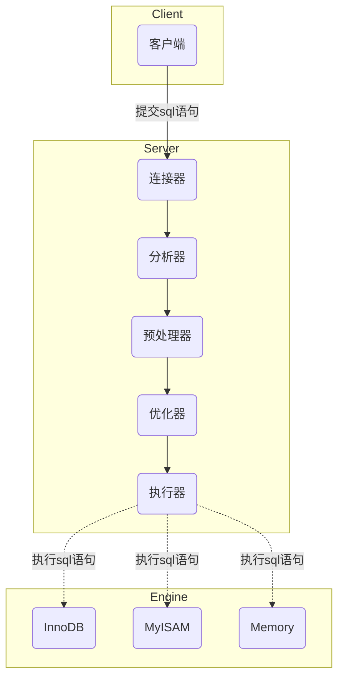

# MySQL基础

## 一、MySQL执行流程

一条SQL语句通常会经历如下的执行过程：



如图所示，MySQL采用C/S架构，整体包括三大部分：客户端、服务端、存储引擎。在执行SQL语句时，各部分的主要功能如下：

- 客户端：负责与服务端建立连接，并提交SQL命令和语句

- 服务端：处理客户端的请求，并将结果返回给客户端
  
  - 连接器：处理客户端的连接请求，验证用户名和密码，校验通过后，读取用户的权限
  - 分析器：包括词法分析和语法分析，通过SQL语句构建语法树，校验语法是否符合MySQL规范
  - 预处理器：将\*扩展为全部字段，检查表和表字段是否存在
  - 优化器：选择执行时使用的索引，确定执行方案
  - 执行器：与存储引擎交互，按方案执行

- 存储引擎：负责数据的存储和提取

## 二、SQL语句执行顺序

SQL语言的书写顺序并不是实际的执行顺序，二者区别如下：

- 书写顺序
  
  ```sql
  SELECT DISTINCT <select_list>
  FROM <left_table>
  <join_type> JOIN <right_table> 
  ON <join_condition>
  WHERE <where_condition>
  GROUP BY <group_by_list>
  HAVING <having_condition>
  ORDER BY <order_by_condition>
  LIMIT <limit_number>
  ```

- 执行顺序
  
  ```sql
  FROM  <left_table>
  CROSS JOIN <right_table> 
  ON <join_condition>
  <join_type> JOIN
  WHERE <where_condition>
  GROUP BY <group_by_list>
  HAVING <having_condition>
  SELECT
  DISTINCT <select_list>
  ORDER BY <order_by_condition>
  LIMIT <limit_number>
  ```

在执行过程中，每一步操作都会产生一个虚拟表，该虚拟表作为下一个操作使用的数据表。可以看出，执行可以大致分为三阶段：

1. 生成数据表

FROM子句将左表和右表进行笛卡尔积，生成虚拟表VT1

ON子句对VT1进行过滤，满足连接条件的记录生成虚拟表VT2

JOIN子句判断join_type的类型，如果是outer join，将左表或右表中被过滤的记录插入VT2，得到虚拟表VT3

2. 筛选行记录和列字段

WHERE子句对VT3进行筛选，满足条件的记录生成虚拟表VT4

GROUP BY子句对VT4进行分组，应用聚合函数计算字段，生成虚拟表VT5

HAVING子句对VT5进行筛选，满足条件的记录生成虚拟表VT6

SELECT子句对VT6的字段进行筛选和重命名，生成虚拟表VT7

3. 去重排序取Top

DISTINCT子句将VT7中的重复行记录进行删除，生成虚拟表VT8

ORDER BY子句对VT8按指定的列进行排序，生成一个游标VC9（SQL默认是无序集合，排序后成为有序列表，使用游标遍历）

LIMIT子句从VC9开始读取制定数量的行记录，生成并返回结果表RT10

## 三、索引

为了提高数据查询的效率，需要建立并使用索引，类似于书中的目录，可以帮我们快速定位想看的内容。MySQL的索引使用的数据结构是B+树，B+树是一种多叉树，与其他常见的查询类的数据结构对比如下：

| 对比项   | 哈希表  | 有序数组    | 红黑树     | 跳表      | B+树     |
| ----- | ---- | ------- | ------- | ------- | ------- |
| 等值查找  | O(1) | O(logn) | O(logn) | O(logn) | O(logn) |
| 区间查找  | 不支持  | 支持      | 不支持     | 支持      | 支持      |
| 插入和删除 | O(1) | O(n)    | O(logn) | O(logn) | O(logn) |

## 四、日志

## 五、事务
