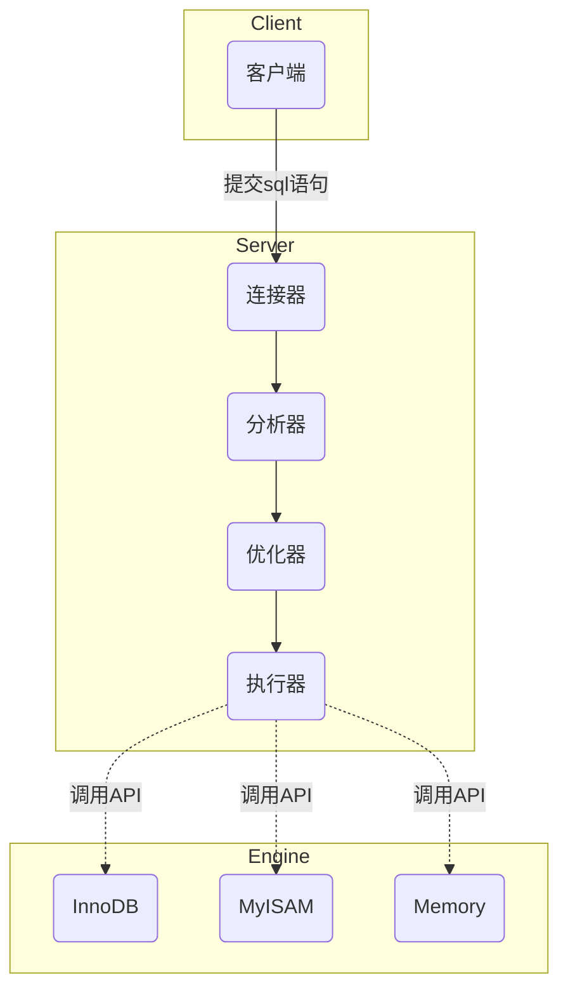

# MySQL基础

## 一、MySQL执行流程



## 二、SQL语句执行顺序
- 书写顺序
```mysql
SELECT DISTINCT <select_list>
FROM <left_table>
<join_type> JOIN <right_table> 
ON <join_condition>
WHERE <where_condition>
GROUP BY <group_by_list>
HAVING <having_condition>
ORDER BY <order_by_condition>
LIMIT <limit_number>
```

- 执行顺序
```mysql
FROM  <left_table>
CROSS JOIN <right_table> 
ON <join_condition>
<join_type> JOIN
WHERE <where_condition>
GROUP BY <group_by_list>
HAVING <having_condition>
SELECT
DISTINCT <select_list>
ORDER BY <order_by_condition>
LIMIT <limit_number>
```

## 三、索引
为了提高数据查询的效率，需要建立并使用索引，类似于书中的目录，可以帮我们快速定位想看的内容。
MySQL的索引使用的数据结构是B+树，B+树是一种多叉树，与其他常见的查询类的数据结构对比如下：
| 对比项 | 哈希表 | 有序数组 | 红黑树 | 跳表 | B+树 |
|-------|-------|-------|-------|-------|-------|
| 等值查找 | O(1) | O(logn) | O(logn) | O(logn) | O(logn) |
| 区间查找 | 不支持 | 支持 | 不支持 | 支持 | 支持 |
| 插入和删除 | O(1) | O(n) | O(logn) | O(logn) | O(logn) |


## 四、日志

## 五、事务


