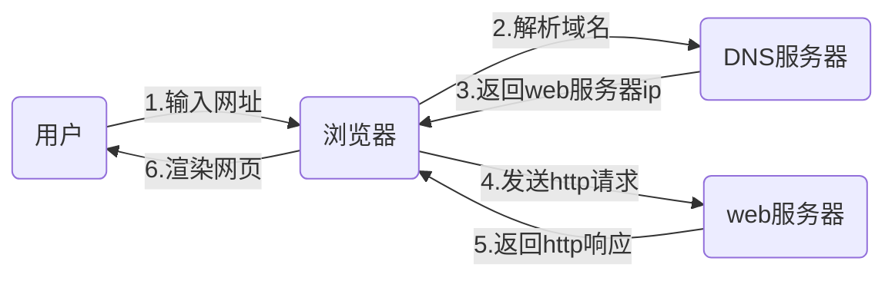
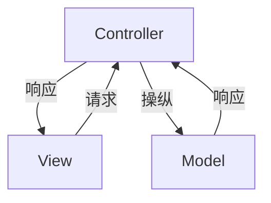

# 零基础Web开发入门

## 浏览器都做了些什么

### DNS协议
解析域名到ip的对应关系

### HTTP协议
传输互联网数据

## 网页三件套
### HTML
超文本标记语言，定义网页的结构和内容

### CSS
层叠样式表，定义HTML元素的字体、颜色、位置等样式

### JavaScript
动态脚本语言，为网页提供动态交互特性

## Web开发
### MVC架构
- Model: 数据模型，比如数据库中的数据表
- View：界面UI等，是用户看到的内容
- Controller：实现Model到View之间的转换

例如，Model存放了用户表，订单表，View展示了用户的个人信息和订单详情，Controlller实现了用户表和订单表的关联查询。

### Flask
Flask是基于werkzeug和jinja2封装的一个轻量Web开发框架
1. werkzeug
WSGI工具库，封装了Request、Response等基础内容，是Web框架的底层

> - 什么是WSGI
全称Python Web Server Gateway Interface，定义Web应用和Web服务之间的通用接口。
Flask、Django实际上都是Web应用开发框架，Gunicorn、Waitress则是Web服务器，Web应用框架和Web服务器之间需要定义一套标准的通信协议，于是就有了WSGI。

2. jinja2
模板库，将数据与模板分离，通过预定义模板，快速生成HTML网页
